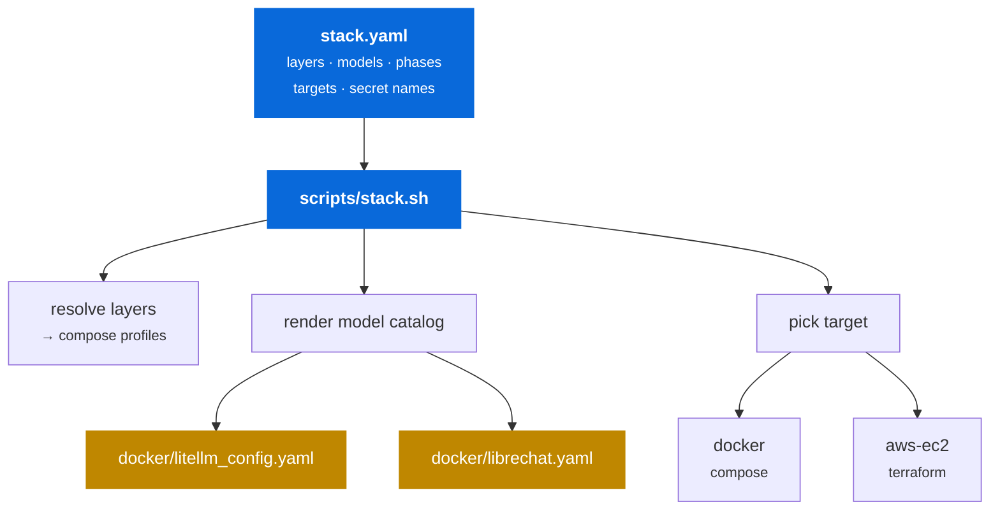

# Configuration

One declarative file describes **what** the stack is. The script resolves the
selected target and profile. Only the Docker target is currently implemented;
AWS and Kubernetes remain declarations of the intended interface.



---

## `stack.yaml`

The single source of truth: layers and their implementations, the model catalog, build-out phases, deployment targets, and the **names** of every secret.

It never contains a secret value, and it never names a specific host. That is deliberate — the same file describes a laptop deployment and a cloud one.

```yaml
schema: 1

project:
  name: sovereign-ai-stack
  environment: demo

defaults:
  target: docker
  profile: phase-1
```

### Layers

```yaml
layers:
  gateway:
    phase: 1
    enabled: true
    impl: litellm
    managed_by: compose
    compose_profile: gateway
    port: 4000
    requires: []
    options:
      master_key_env: LITELLM_MASTER_KEY
      callbacks:
        success: [langfuse]
        failure: [langfuse]
```

| Key | Meaning |
|---|---|
| `phase` | Which build-out phase introduces this layer |
| `enabled` | `false` = declared but not wired up in this repo yet |
| `impl` | The swappable implementation (`litellm`, `vllm`, `minio`, …) |
| `managed_by` | `compose` · `runpod` · `external` — who owns the lifecycle |
| `compose_profile` | Compose profile that starts it, or `null` if not a compose service |
| `requires` | Other layers this one cannot run without — resolved transitively |

!!! note "`managed_by` matters"
    The `serving` layer is `managed_by: runpod` — it is **not** a compose service. `stack.sh` won't try to start it; it validates that `VLLM_API_BASE` points somewhere live instead.

### Models

The model catalog is the one place models are defined:

```yaml
models:
  - alias: claude-sonnet
    phase: 1
    enabled: true
    tier: commercial
    provider: anthropic
    litellm_model: anthropic/claude-sonnet-4-5
    api_key_env: ANTHROPIC_API_KEY
    context_window: 200000
    cost_per_1k: { input: 0.003, output: 0.015 }
    rate_limit: { rpm: 500, tpm: 400000 }
    ui:
      label: Claude Sonnet 4.5
      description: Anthropic commercial API, format-translated by LiteLLM.
```

Costs are authored **per 1,000 tokens** because that is how provider pricing pages read. The renderer converts to LiteLLM's per-token fields, so Langfuse cost attribution stays correct without anyone counting zeros by hand.

---

## `scripts/stack.sh`

Resolves the config for a chosen `--target` and `--profile`, then renders the model catalog into the two configs that would otherwise duplicate it.

!!! success "Why render at all"
    A model has to be declared twice in a naive setup — once in LiteLLM's `model_list` so the gateway can route it, and once in LibreChat's `models.default` so the UI offers it. Those two lists drift, and the failure mode is a model in the picker that 400s on use. Rendering both from one catalog removes the class of bug.

`docker-compose.yml` stays **hand-written and greppable** — layer selection maps onto native compose profiles rather than generating YAML. Only the genuinely duplicated part is generated.

### Commands

| Command | Purpose |
|---|---|
| `doctor` | Preflight: tooling, secrets, layers, models |
| `secrets setup` | Technology-grouped credential menu: input, defaults, generation, `.env` write |
| `secrets status \| validate` | Report presence and check formats without printing values |
| `secrets write \| generate \| audit` | Automation primitives and leak checks |
| `phases` | Build-out phases and current status |
| `config` | Resolved stack for the selected target/profile |
| `models` | Model table with per-1k costs |
| `render` | Regenerate `litellm_config.yaml` + `librechat.yaml` |
| `up` | Render, then deploy to the selected target |
| `status` | Curl every health check for active layers |
| `urls` | Print the endpoint list |
| `logs` | Follow compose logs |
| `down` | Tear down (`--purge` also drops volumes) |

### Flags

| Flag | Effect |
|---|---|
| `-t, --target <name>` | Deployment target — default from `defaults.target` |
| `-p, --profile <name>` | Stack profile — default from `defaults.profile` |
| `--tf-var k=v` | Extra Terraform variable (repeatable) |
| `--all` | `doctor`: check every phase's secrets, not just active |
| `--no-render` | Skip config rendering on `up` |
| `--purge` | `down`: also delete volumes — **destructive** |
| `-n, --dry-run` | Print commands instead of running them |
| `-f, --file <path>` | Alternate `stack.yaml` |

!!! info "bash 3.2"
    `stack.sh` targets bash 3.2 so macOS system bash works with no upgrade — no associative arrays, no `readarray`, no `${var^^}`. Its only hard dependency is [mikefarah/yq](https://github.com/mikefarah/yq) v4 (`brew install yq`).

---

## Inspecting the resolved stack

```console
$ ./scripts/stack.sh config
project  sovereign-ai-stack (demo)
target   docker — Single-node Docker Compose on a laptop
profile  phase-1 — Phase 1 — frontier models (OpenAI + Anthropic), no self-hosting

layers
  gateway        litellm      compose    gateway
  observability  langfuse     compose    obs
  ui             librechat    compose    ui

compose profiles  gateway obs ui
models            gpt-4o claude-sonnet
```

```console
$ ./scripts/stack.sh models
ALIAS           TIER         LITELLM_MODEL                          IN/1k      OUT/1k
gpt-4o          commercial   openai/gpt-4o                          0.0025     0.01
claude-sonnet   commercial   anthropic/claude-sonnet-4-5            0.003      0.015
```

---

## Adding a model

Add one entry to `models:` in `stack.yaml`, then re-render. The gateway and the UI picker update together:

```yaml
- alias: gpt-4o-mini
  phase: 1
  enabled: true
  tier: commercial
  provider: openai
  litellm_model: openai/gpt-4o-mini
  api_key_env: OPENAI_API_KEY
  context_window: 128000
  cost_per_1k: { input: 0.00015, output: 0.0006 }
  ui:
    label: GPT-4o mini
    description: Cheap, fast baseline for cost comparisons.
```

```bash
./scripts/stack.sh render && ./scripts/stack.sh up
```

---

## Generated files

`docker/litellm_config.yaml` and `docker/librechat.yaml` carry a generation banner and **must not be hand-edited** — `render` overwrites them, and `up` renders by default.

```yaml title="docker/litellm_config.yaml (generated)"
# GENERATED by scripts/stack.sh render — DO NOT EDIT.
# Edit stack.yaml and re-run `./scripts/stack.sh render`.
# profile: phase-1

model_list:
  - model_name: gpt-4o
    litellm_params:
      model: openai/gpt-4o
      api_key: os.environ/OPENAI_API_KEY
      rpm: 500
      tpm: 800000
    model_info:
      mode: chat
      max_input_tokens: 128000
      input_cost_per_token: 2.5e-06
      output_cost_per_token: 1e-05
```

They are committed anyway, so a reader can see the gateway config without running anything. Use `--no-render` for a one-off manual override.
