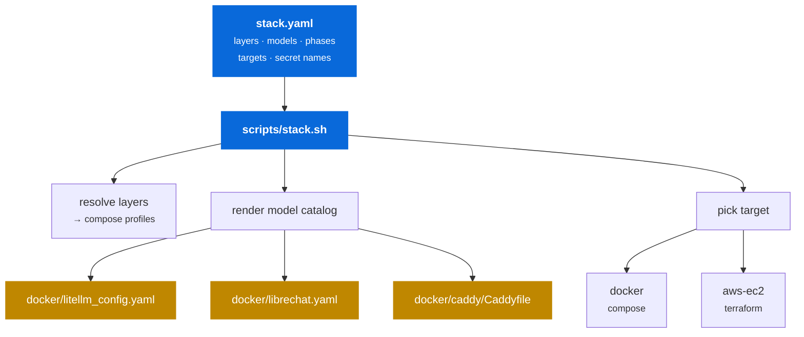
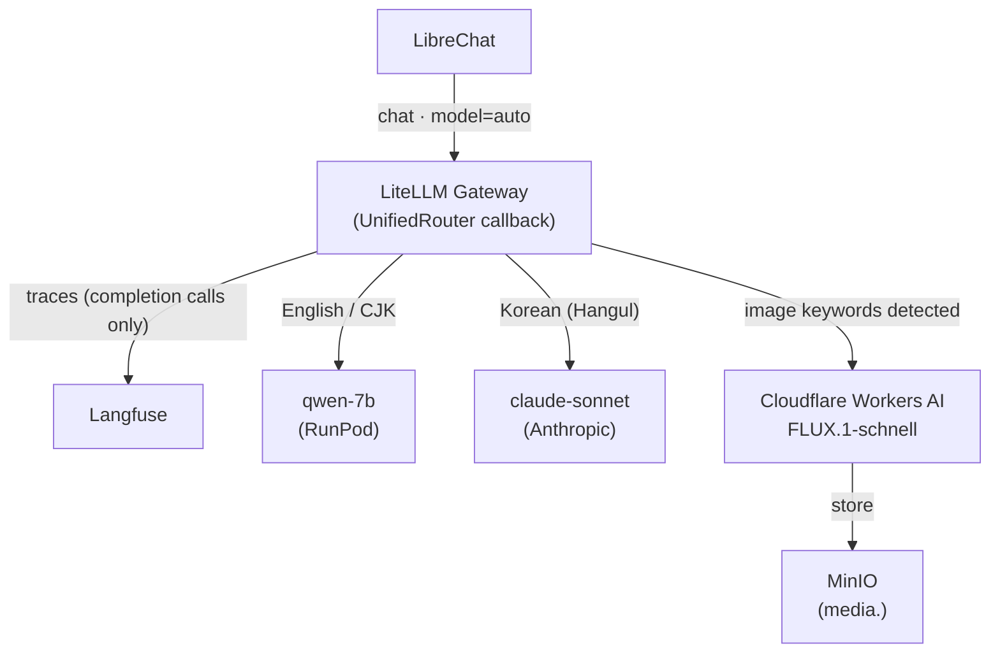
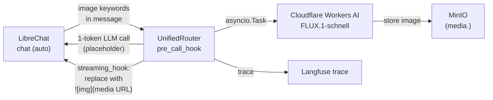
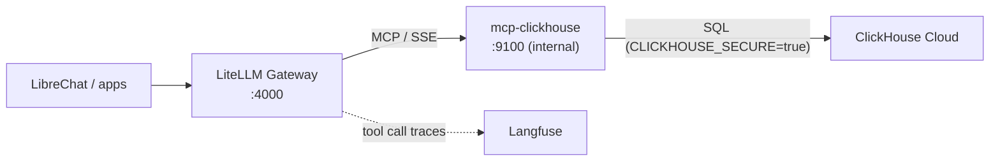

# Configuration

One declarative file describes **what** the stack is. The script resolves the
selected target and profile. Both the `docker` and `aws-ec2` targets are
currently runnable; `k8s` remains a declaration of the intended interface.



---

## `stack.yaml`

The single source of truth: layers and their implementations, the model catalog, build-out phases, deployment targets, and the **names** of every secret.

It never contains a secret value, and it never names a specific host. That is deliberate — the same file describes a laptop deployment and a cloud one.

```yaml
schema: 1

project:
  name: llmops-in-a-box
  environment: demo

defaults:
  target: docker
  profile: phase-1
```

### Layers

```yaml
layers:
  gateway:
    phase: 1
    enabled: true
    impl: litellm
    managed_by: compose
    compose_profile: gateway
    port: 4000
    requires: []
    options:
      master_key_env: LITELLM_MASTER_KEY
      callbacks:
        success: []
        failure: []
```

| Key | Meaning |
|---|---|
| `phase` | Which build-out phase introduces this layer |
| `enabled` | `false` = declared but not wired up in this repo yet |
| `impl` | The swappable implementation (`litellm`, `vllm`, `minio`, …) |
| `managed_by` | `compose` · `runpod` · `external` — who owns the lifecycle |
| `compose_profile` | Compose profile that starts it, or `null` if not a compose service |
| `requires` | Other layers this one cannot run without — resolved transitively |

!!! note "`managed_by` matters"
    The `serving` layer is `managed_by: runpod` — it is **not** a compose service. `stack.sh` won't try to start it; it validates that `VLLM_API_BASE` points somewhere live instead.

### Models

The model catalog is the one place models are defined:

```yaml
models:
  - alias: claude-sonnet
    phase: 1
    enabled: true
    tier: commercial
    provider: anthropic
    litellm_model: anthropic/claude-sonnet-4-5
    api_key_env: ANTHROPIC_API_KEY
    context_window: 200000
    cost_per_1k: { input: 0.003, output: 0.015 }
    rate_limit: { rpm: 500, tpm: 400000 }
    ui:
      label: Claude Sonnet 4.5
      description: Anthropic commercial API, format-translated by LiteLLM.
```

Costs are authored **per 1,000 tokens** because that is how provider pricing pages read. The renderer converts to LiteLLM's per-token fields, so Langfuse cost attribution stays correct without anyone counting zeros by hand.

---

## `scripts/stack.sh`

Resolves the config for a chosen `--target` and `--profile`, then renders the model catalog into the two configs that would otherwise duplicate it.

!!! success "Why render at all"
    A model has to be declared twice in a naive setup — once in LiteLLM's `model_list` so the gateway can route it, and once in LibreChat's `models.default` so the UI offers it. Those two lists drift, and the failure mode is a model in the picker that 400s on use. Rendering both from one catalog removes the class of bug.

`docker-compose.yml` stays **hand-written and greppable** — layer selection maps onto native compose profiles rather than generating YAML. Only the genuinely duplicated part is generated.

### Commands

| Command | Purpose |
|---|---|
| `doctor` | Preflight: tooling, secrets, layers, models |
| `secrets setup` | Technology-grouped credential menu: input, defaults, generation, `.env` write |
| `secrets domain` | Set `DOMAIN_BASE` and `DOMAIN_SSL_EMAIL` for the aws-ec2 HTTPS proxy |
| `secrets status \| validate` | Report presence and check formats without printing values |
| `secrets write \| generate \| audit` | Automation primitives and leak checks |
| `secrets push` | Push `.env` values to SSM Parameter Store (aws-ec2 target) |
| `phases` | Build-out phases and current status |
| `config` | Resolved stack for the selected target/profile |
| `models` | Model table with per-1k costs |
| `render` | Regenerate `litellm_config.yaml`, `librechat.yaml`, and (aws-ec2) `Caddyfile` |
| `up` | Render, then deploy to the selected target |
| `status` | Curl every health check for active layers |
| `urls` | Print the endpoint list |
| `logs` | Follow compose logs |
| `down` | Tear down (`--purge` also drops volumes) |
| `ssh` | SSH into the EC2 instance (aws-ec2 target only) |

### Flags

| Flag | Effect |
|---|---|
| `-t, --target <name>` | Deployment target — default from `defaults.target` |
| `-p, --profile <name>` | Stack profile — default from `defaults.profile` |
| `--tf-var k=v` | Extra Terraform variable (repeatable) |
| `--all` | `doctor`: check every phase's secrets, not just active |
| `--no-render` | Skip config rendering on `up` |
| `--purge` | `down`: also delete volumes — **destructive** |
| `-n, --dry-run` | Print commands instead of running them |
| `-f, --file <path>` | Alternate `stack.yaml` |

!!! info "bash 3.2"
    `stack.sh` targets bash 3.2 so macOS system bash works with no upgrade — no associative arrays, no `readarray`, no `${var^^}`. Its only hard dependency is [mikefarah/yq](https://github.com/mikefarah/yq) v4 (`brew install yq`).

---

## Inspecting the resolved stack

```console
$ ./scripts/stack.sh config
project  llmops-in-a-box (demo)
target   docker — Single-node Docker Compose on a laptop
profile  phase-1 — Phase 1 — frontier models (OpenAI + Anthropic), no self-hosting

layers
  gateway        litellm      compose    gateway
  observability  langfuse     compose    obs
  ui             librechat    compose    ui

compose profiles  gateway obs ui
models            claude-sonnet
```

```console
$ ./scripts/stack.sh models
ALIAS           TIER         LITELLM_MODEL                          IN/1k      OUT/1k
claude-sonnet   commercial   anthropic/claude-sonnet-4-5            0.003      0.015
```

---

## Adding a model

Add one entry to `models:` in `stack.yaml`, then re-render. The gateway and the UI picker update together:

```yaml
- alias: gpt-4o-mini
  phase: 1
  enabled: true
  tier: commercial
  provider: openai
  litellm_model: openai/gpt-4o-mini
  api_key_env: OPENAI_API_KEY
  context_window: 128000
  cost_per_1k: { input: 0.00015, output: 0.0006 }
  ui:
    label: GPT-4o mini
    description: Cheap, fast baseline for cost comparisons.
```

```bash
./scripts/stack.sh render && ./scripts/stack.sh up
```

---

## Routing overview

Phase 1 has two routing paths. Both go through LiteLLM and produce Langfuse
traces.



The chat path and the image path share the same gateway endpoint and the same
Langfuse project. No client-side changes are needed to switch providers.

---

## Language routing

LiteLLM routes chat requests automatically by the dominant script of the last user message — no client changes required.

| Detected script | Target model |
|---|---|
| Hangul (Korean) | `claude-sonnet` |
| CJK (Chinese, Japanese) | `qwen-7b` |
| Latin (English, etc.) | `qwen-7b` |

Detection is a pure Unicode heuristic: if more than 15 % of the message's characters have code points above U+024F (where extended Latin ends), the message is classified as non-Latin. A single Korean word in an otherwise-English sentence does **not** flip the route.

The router only rewrites the `model` field when the client sends `"auto"` or an empty string. Any other value (e.g. `"claude-sonnet"`) is treated as an explicit model choice and left untouched. Non-chat requests (`call_type` not in `{"completion", "acompletion"}`) bypass the callback entirely.

**Fallback:** `qwen-7b → claude-sonnet`. When the RunPod pod is cold or unavailable, LiteLLM falls back to `claude-sonnet` automatically. The virtual `auto` model also falls back to `claude-sonnet`, because the language-routing callback rewrites `auto` to a specific model *before* dispatch — if that model then fails, LiteLLM uses the fallback registered for the *original* group name (`auto`).

**Langfuse spans:** The `async_log_success_event` callback logs to Langfuse only for `completion` and `acompletion` call types — management API calls (`/v2/user/info`, etc.) are skipped to avoid noise traces. Each trace may contain two types of child spans: a `routing` span recording the detected script and routed model; and `tool-result/[tool_name]` spans emitted when LibreChat runs MCP tool calls in its agentic loop, each carrying the `tool_call_id` and response content.

The routing logic lives in `docker/litellm_callbacks.py` as a `CustomLogger` pre-call hook and is controlled by `stack.yaml`:

```yaml
layers:
  gateway:
    options:
      language_routing:
        enabled: true
        english_model: qwen-7b
        multilingual_model: claude-sonnet  # Korean
        cjk_model: qwen-7b
        threshold: 0.15
      routing:
        fallbacks:
          - from: qwen-7b
            to: [claude-sonnet]
          - from: auto
            to: [claude-sonnet]
```

When `language_routing.enabled` is `true`, `render` adds `callbacks: [callbacks.language_router]` to `litellm_settings` in the generated config, and the callback file is mounted read-only into the `litellm` container at `/app/callbacks.py`.

To disable routing and send all requests to a single model, set `language_routing.enabled: false` and re-render.

---

## Automated scoring

Every completion trace receives five scores automatically. No client change is needed.

### Score inventory

| Score name | Type | Description |
|---|---|---|
| `routing_accuracy` | BOOLEAN | `1.0` when the request reached the intended model; `0.0` when a fallback was triggered |
| `language_consistency` | BOOLEAN | `1.0` when the dominant script of the output matches the dominant script of the input |
| `latency_score` | NUMERIC | Linear decay from `1.0` at 0 s to `0.0` at 30 s — configurable cap |
| `helpfulness` | NUMERIC | LLM-as-judge score (0.0–1.0): how well the response answers the user's question |
| `judge_language_match` | BOOLEAN | LLM-as-judge opinion on whether the response language matches the request language |

### Score tiers

**Rule-based (synchronous)** — `routing_accuracy`, `language_consistency`, and `latency_score` are computed inside `async_log_success_event` before the event returns. They add no latency to the gateway response.

**LLM-as-judge (asynchronous)** — `helpfulness` and `judge_language_match` are computed by a direct call to the Anthropic API (`claude-haiku-4-5-20251001`). The call is dispatched as a fire-and-forget `asyncio.Task` so it does not block the response path. The judge calls Anthropic directly via `httpx` rather than through LiteLLM to avoid triggering the scoring callbacks recursively.

**User feedback (sidecar)** — a lightweight FastAPI service (`feedback`) runs alongside the gateway. It maintains a SHA-256(content[:500]) → trace-id index. The LiteLLM callback populates the index automatically after each response via `POST /register`. LibreChat feedback can be correlated to a Langfuse trace by posting the response text to `POST /feedback`:

```bash
curl -X POST http://localhost:8080/feedback \
  -H "Content-Type: application/json" \
  -d '{"content": "<first 500 chars of response>", "rating": 1}'
```

The service accepts `rating` as `1` (thumbs-up) or `-1` (thumbs-down).

### Implementation notes

- `success_callback: []` in `docker/litellm_config.yaml` is intentional. All Langfuse logging, including scoring, is performed manually inside the callback, so management API calls never produce traces or scores.
- The judge model is set by `_JUDGE_MODEL` in `docker/litellm_callbacks.py`. Changing this requires rebuilding the `litellm` container.
- The latency cap is `_LATENCY_CAP_S = 30.0`. Adjust in `litellm_callbacks.py` and rebuild.
- `ANTHROPIC_API_KEY` must be set in `.env` for judge scores to be computed. If absent, the judge task exits silently and the two judge scores are omitted.

---

## Image generation

Image generation is triggered directly from chat — type an image-intent message (e.g. "그려줘", "draw …", "generate an image of …") in the `auto` chat window and the `UnifiedRouter` callback detects the intent, calls Cloudflare Workers AI directly, and replaces the LLM response with the generated image before it reaches LibreChat.



The callback calls Cloudflare Workers AI directly via `httpx` (LiteLLM's built-in image generation endpoint does not correctly support Cloudflare). The generated image is stored in MinIO and served via the `media.<domain>` subdomain. The `async_post_call_streaming_iterator_hook` drains the 1-token LLM stream and replaces it with a streaming SSE chunk containing the markdown image link. LibreChat renders the image inline.

Image generation is enabled by default when the credentials are present.
The relevant `stack.yaml` block:

```yaml
layers:
  gateway:
    options:
      image_generation:
        enabled: true
        # dalle_alias is the model name LibreChat requests for image generation.
        # The UnifiedRouter callback intercepts chat requests with this alias
        # and routes them to Cloudflare — it does NOT call OpenAI DALL-E.
        dalle_alias: dall-e-3
        timeout: 90
        providers:
          cloudflare:
            model: "@cf/black-forest-labs/flux-1-schnell"
            api_key_env: CF_API_TOKEN
            account_id_env: CF_ACCOUNT_ID
```

The credentials (`CF_API_TOKEN`, `CF_ACCOUNT_ID`) are optional.
If absent, image generation fails with an API error; the chat path is unaffected.
To disable cleanly, set `image_generation.enabled: false` and re-render.

See [Credentials — Image generation](credentials.md#image-generation-free-tier)
for token acquisition steps.

---

## MCP tool layer (Phase 2)

MCP tools are wired at the **gateway** layer, not at the client. Every
application that reaches LiteLLM gains the same tool access automatically —
no per-client configuration required.



`mcp-clickhouse` only supports stdio transport natively. The `docker/mcp/Dockerfile` wraps it with `mcp-proxy`, which exposes an SSE endpoint on port 9100 inside the Docker network. That port is **internal to the Docker network only** — no security group change is needed for the aws-ec2 target. LibreChat's SSRF protection is bypassed for this internal address by the `mcpSettings.allowedAddresses` entry that `render` adds to `docker/librechat.yaml`.

### stack.yaml — tools layer

```yaml
layers:
  tools:
    phase: 2
    enabled: true
    impl: mcp
    managed_by: compose
    compose_profile: tools
    servers:
      clickhouse:
        enabled: true
        image: mcp-clickhouse
        port: 9100
        transport: sse
```

Enable this layer for `--profile phase-2`:

```yaml
profiles:
  phase-2:
    layers: [gateway, observability, ui, tools]
```

### Generated litellm_config.yaml

`render --profile phase-2` appends the `mcp_servers` block to the generated
`docker/litellm_config.yaml`:

```yaml title="docker/litellm_config.yaml (excerpt)"
mcp_servers:
  clickhouse:
    url: "http://mcp-clickhouse:9100/sse"
    transport: "sse"
```

`render` also adds the following block to `docker/librechat.yaml` to exempt the internal Docker hostname from LibreChat's SSRF protection:

```yaml title="docker/librechat.yaml (excerpt)"
mcpSettings:
  allowedAddresses:
    - "mcp-clickhouse:9100"

mcpServers:
  clickhouse:
    type: sse
    url: "http://mcp-clickhouse:9100/sse"
```

### Deploying Phase 2

```bash
./scripts/stack.sh render --profile phase-2
./scripts/stack.sh up --profile phase-2
```

Set the required credentials first (see
[Credentials — MCP (ClickHouse Cloud)](credentials.md#mcp-clickhouse-cloud)):

```bash
./scripts/stack.sh secrets setup --phase 2
```

---

## Domain / HTTPS proxy (aws-ec2)

The `aws-ec2` target includes an optional Caddy reverse proxy that provides
automatic HTTPS via Let's Encrypt — no certificate management required.

### Configuring a domain

Set the domain interactively and push to SSM before provisioning:

```bash
./scripts/stack.sh secrets domain   # prompts for DOMAIN_BASE and DOMAIN_SSL_EMAIL
./scripts/stack.sh secrets push --target aws-ec2
```

DNS setup — create `A` records for each subdomain pointing at the EC2 public IP:

| Subdomain | Service |
|---|---|
| `chat.<domain>` | LibreChat |
| `langfuse.<domain>` | Langfuse |
| `litellm.<domain>` | LiteLLM |
| `media.<domain>` | MinIO (image storage) |

The root domain is not touched — it can point elsewhere (e.g. a homepage).

### How it works

At first boot, `bootstrap-ec2.sh` reads `DOMAIN_BASE` from SSM. If set:

1. Runs `./scripts/stack.sh render --target aws-ec2` to generate `docker/caddy/Caddyfile`
2. Starts the `proxy` compose profile (`caddy` service)
3. Caddy performs the ACME TLS-ALPN-01 challenge on port 443 and obtains certs from Let's Encrypt

Certificates are stored in a `caddy-data` named volume and auto-renewed at 30 days before expiry. As long as the instance is reachable on port 443, certs stay current indefinitely.

### Access restriction

LibreChat allows registration only from permitted email domains:

```bash
# Set in .env (EC2) or pushed to SSM:
LIBRECHAT_ALLOWED_EMAIL_DOMAINS=clickhouse.com
```

Anyone can reach the registration form, but accounts are created only for
addresses matching the configured domain. Set to an empty value to allow all domains.

### Subdomain defaults

Subdomain prefixes are declared in `stack.yaml` under `targets.aws-ec2.domain.subdomains`
and can be customised:

```yaml
targets:
  aws-ec2:
    domain:
      base: ""           # overridden by DOMAIN_BASE env var
      ssl_email: ""      # overridden by DOMAIN_SSL_EMAIL env var
      subdomains:
        litellm: litellm
        langfuse: langfuse
        librechat: chat
        media: media
```

---

## Generated files

`docker/litellm_config.yaml`, `docker/librechat.yaml`, and `docker/caddy/Caddyfile` carry a generation banner and **must not be hand-edited** — `render` overwrites them, and `up` renders by default. The Caddyfile is only generated when `--target aws-ec2` is used and `DOMAIN_BASE` is set.

```yaml title="docker/litellm_config.yaml (generated)"
# GENERATED by scripts/stack.sh render — DO NOT EDIT.
# Edit stack.yaml and re-run `./scripts/stack.sh render`.
# profile: phase-1

model_list:
  - model_name: claude-sonnet
    litellm_params:
      model: anthropic/claude-sonnet-4-5
      api_key: os.environ/ANTHROPIC_API_KEY
      rpm: 500
      tpm: 400000
      timeout: 5
    model_info:
      mode: chat
      max_input_tokens: 200000
      input_cost_per_token: 3e-06
      output_cost_per_token: 1.5e-05
  - model_name: auto
    litellm_params:
      model: qwen-7b
    model_info:
      mode: chat
```

They are committed anyway, so a reader can see the gateway config without running anything. Use `--no-render` for a one-off manual override.
