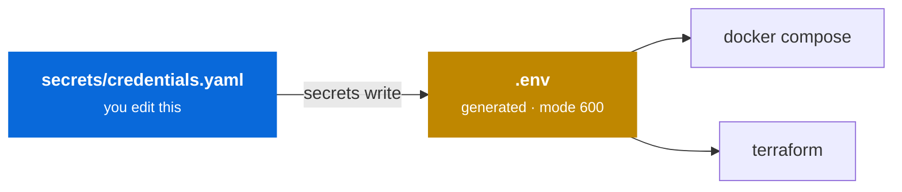

---
hide:
  - navigation
---

# Credentials

Every API key the stack touches — OpenAI, Anthropic, RunPod, AWS, ClickHouse Cloud, Langfuse, MinIO — is inventoried in **one** file.



`secrets/credentials.yaml` is the only credential file you hand-edit. `.env` is derived from it and **gets overwritten** — never edit it directly.

---

## Setup

```bash
cp secrets/credentials.example.yaml secrets/credentials.yaml
./scripts/stack.sh secrets gen            # values for the self-generated keys
$EDITOR secrets/credentials.yaml          # paste those + your provider keys
./scripts/stack.sh secrets write          # generate .env (mode 600)
./scripts/stack.sh doctor                 # verify the stack sees them
```

`secrets gen` prints a fresh value for every credential that declares a `generate:` command:

```console
$ ./scripts/stack.sh secrets gen
==> Suggested values for self-generated credentials

  LITELLM_MASTER_KEY                 sk-f0476d619643e60b4e415c8b09320937fc0b315ccbd803a8
  LITELLM_SALT_KEY                   8e876ba991f91b74a465c93587a499774294888d30227840079b7798bc65af35
  NEXTAUTH_SECRET                    kRHoSMTAbV0rJ4vVb+dY80QVuSovpTm3TWSPE5HH4BQ=
  CLICKHOUSE_PASSWORD                8cf628e750a627956d67a9df30c2c41b
```

---

## Inventory format

Each entry records more than a value — where to get it, what scopes it needs, who owns it, and how often to rotate. The file doubles as an audit artifact rather than a bag of strings.

```yaml
- name: ClickHouse Cloud user
  phase: 2
  env: CLICKHOUSE_CLOUD_USER
  value: ""
  console: https://clickhouse.cloud → service → Settings → Users
  scopes: [SELECT]
  notes: >-
    Create a dedicated READ-ONLY user for the MCP server. An agent with a
    tool has the user's full grants — do not reuse the admin account.
  owner: ""
  rotates: 90d
```

| Field | Purpose |
|---|---|
| `env` | The variable name the stack reads — must match `stack.yaml` `secrets:` |
| `value` | The secret itself. Empty in the committed template |
| `console` | Where to obtain or rotate it |
| `generate` | Shell command producing a value, for self-generated secrets |
| `scopes` | Least-privilege grants this credential should have |
| `phase` | Which build-out phase needs it |
| `owner` / `rotates` | Accountability and cadence for audits |

---

## Ignore coverage

`secrets/credentials.yaml` and `.env` are excluded from git, from Docker build contexts, and from every AI coding tool with a repo-level exclusion mechanism.

| Tool | Mechanism | File |
|---|---|---|
| Git | ignore rules | `.gitignore` |
| Docker | build-context exclusion | `.dockerignore` |
| Claude Code | `permissions.deny` on `Read` | `.claude/settings.json` |
| Cursor | ignore rules | `.cursorignore` |
| JetBrains AI Assistant | ignore rules | `.aiignore` |
| Gemini Code Assist | ignore rules | `.aiexclude`, `.geminiignore` |
| Codeium / Windsurf | ignore rules | `.codeiumignore` |
| Aider | ignore rules | `.aiderignore` |
| Continue | ignore rules | `.continueignore` |
| OpenAI Codex CLI | honours `.gitignore`; `.codexignore` as belt-and-braces | `.codexignore` |

!!! danger "GitHub Copilot is the exception"
    Copilot has **no repo-level ignore file**. Content exclusions are configured server-side, per repository or organisation, under *Settings → Copilot → Content exclusions*. Add `secrets/**`, `.env`, and `**/*.tfvars` there.

    Until you do, assume Copilot can see these files.

### Verifying

```bash
./scripts/stack.sh secrets audit
```

```console
==> Ignore coverage
  ✓ git ignores .env
  ✓ git ignores secrets/credentials.yaml
  ✓ .dockerignore covers secrets/ and .env
  ✓ .cursorignore covers secrets/ and .env
  ...
  ✓ .claude/settings.json denies Read on secrets/
==> Nothing sensitive tracked
  ✓ .env not in the index
  ✓ secrets/credentials.yaml not in the index
  ✓ .env absent from history
  ✓ secrets/credentials.yaml absent from history
==> Committed template is value-free
  ✓ credentials.example.yaml has no real values

secrets audit passed
```

The audit checks three separate things, because they fail independently:

1. **Ignore rules exist** in all twelve mechanisms.
2. **Nothing is tracked** — not in the index, and *not anywhere in git history*. A file can be correctly ignored today and still be sitting in a commit from last week.
3. **The committed template is value-free** — the one file in `secrets/` that *is* committed must never gain a real value.

Run it before committing anything under `secrets/`.

---

## Security posture

!!! warning "`LITELLM_MASTER_KEY` is the crown jewel"
    It fronts every provider key. Clients only ever see this one credential — which is the point of a gateway — but it means leaking it exposes **all** downstream spend, not just one provider.

!!! warning "`VLLM_API_KEY` is not optional in practice"
    The RunPod HTTP proxy is public by default. A pod started without `--api-key` is an **open GPU on the internet**. Always set it.

!!! warning "Never open the security group to `0.0.0.0/0`"
    The demo ports are unauthenticated by default and the stack holds live provider keys. Set `allowed_cidr` to your own IP as `<ip>/32`.

**Prefer AWS IAM Identity Center** (`AWS_PROFILE` via `aws configure sso`) over static access keys. If SSO is available, leave `AWS_ACCESS_KEY_ID` and `AWS_SECRET_ACCESS_KEY` blank — Terraform picks up the profile.

**Scope tool credentials tightly.** From Phase 2 an agent can call tools, and it holds whatever grants the credential has. A read-only ClickHouse Cloud user is the difference between an agent that can answer questions and one that can `DROP TABLE`.

---

## If a credential leaks

1. **Revoke first, at the provider.** Rotating the value in your file does nothing to a key that has already been pushed. Assume anything committed is compromised the moment it lands.
2. Issue a replacement and run `./scripts/stack.sh secrets write`.
3. *Only then* clean history (`git filter-repo`, or delete the repo if it is young).
4. Note the rotation in `meta.last_reviewed`.

!!! danger "History rewriting is not containment"
    Forks, clones, CI caches, and GitHub's own unreachable-object storage can all retain the blob. Revocation is the control that actually works; rewriting history is cleanup.
