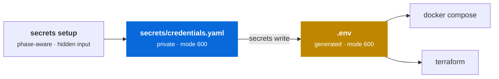

# Credentials

Every API key the stack touches — OpenAI, Anthropic, RunPod, AWS, ClickHouse Cloud, Langfuse, MinIO — is inventoried in **one** file.



`secrets/credentials.yaml` is the private source of truth. The phase-aware setup
command updates it with hidden input; `.env` is derived from it and **gets
overwritten**. Neither command prints secret values.

---

## Setup

```bash
./scripts/stack.sh secrets init
./scripts/stack.sh secrets setup           # all external keys, grouped by phase
./scripts/stack.sh secrets status --all    # set / missing / invalid, no values
./scripts/stack.sh secrets validate --all  # offline format checks
./scripts/stack.sh secrets write           # atomic .env write, mode 600
./scripts/stack.sh doctor
```

You can also operate on one phase or one key:

```bash
./scripts/stack.sh secrets generate --phase 1
./scripts/stack.sh secrets set OPENAI_API_KEY
./scripts/stack.sh secrets status --phase 1
./scripts/stack.sh secrets validate --phase 1
```

`generate` stores locally generated values directly and reports only status.
Existing values are preserved unless `--force` is supplied. `set` accepts one
value with terminal echo disabled and rejects invalid shapes before persisting
it. Phase 5 currently has no dedicated credentials, which is reported
explicitly rather than treated as an error.

---

## Where each credential comes from

Twenty-odd credentials sounds worse than it is, because **you only have to go and fetch about a third of them**. Sorting them by *where a value comes from* is the thing that makes this tractable — and it is also what the automation below is built on.

Each entry's `console:` field in `secrets/credentials.yaml` is the authoritative pointer; this is the map.

### Kind 1 — self-generated (no browser, no account)

These are passwords for services this stack runs itself. Nobody issues them to you; you invent them, and `secrets generate` creates and stores stronger values without printing them.

`LITELLM_MASTER_KEY` · `LITELLM_SALT_KEY` · `LANGFUSE_PUBLIC_KEY` ·
`LANGFUSE_SECRET_KEY` · `NEXTAUTH_SECRET` · `LANGFUSE_SALT` ·
`LANGFUSE_ENCRYPTION_KEY` · `REDIS_AUTH` · `CLICKHOUSE_PASSWORD` ·
`POSTGRES_PASSWORD` · `MINIO_ROOT_PASSWORD` ·
`LIBRECHAT_CREDS_KEY` · `LIBRECHAT_CREDS_IV` · `LIBRECHAT_JWT_SECRET` ·
`LIBRECHAT_JWT_REFRESH_SECRET` · `ARTIFACT_MINIO_ROOT_USER` ·
`ARTIFACT_MINIO_ROOT_PASSWORD` · `VLLM_API_KEY`

```bash
./scripts/stack.sh secrets generate --phase 1
```

`VLLM_API_KEY` is in this list for a reason worth noticing: it is not issued by RunPod. You choose a value and pass it to `vllm serve --api-key` — see vLLM's [OpenAI-compatible server](https://docs.vllm.ai/en/latest/serving/openai_compatible_server.html) docs. That is what makes it easy to skip, and skipping it leaves [an open GPU on the internet](#security-posture).

### Kind 2 — a provider console (you need an account, possibly a payment method)

Each row links the **vendor's own guide**, not just the console, because the console layout changes more often than the docs do.

| Credential | Official guide | Console | What to create | Watch for |
|---|---|---|---|---|
| `OPENAI_API_KEY` | [API authentication](https://platform.openai.com/docs/api-reference/authentication/api-keys) · [reference overview](https://developers.openai.com/api/reference/overview#authentication) | [platform.openai.com/api-keys](https://platform.openai.com/api-keys) | a project-scoped key | shown **once**. A project with no credit returns 429 on the first call, which reads exactly like a bad key |
| `ANTHROPIC_API_KEY` | [Get started with Claude](https://docs.anthropic.com/en/docs/initial-setup) · [API overview](https://docs.anthropic.com/en/api/getting-started) | [console.anthropic.com](https://console.anthropic.com) | a workspace key, in Account Settings | also shown once, and you pick an **expiry date** at creation — a key that worked last quarter may simply have lapsed |
| `LANGFUSE_EE_LICENSE_KEY` | [Enterprise license key](https://langfuse.com/self-hosting/license-key) | Langfuse commercial agreement | the self-hosted license key | optional; leave blank to run the OSS feature set |
| `RUNPOD_API_KEY` | [Manage API keys](https://docs.runpod.io/get-started/api-keys) | Settings → API Keys | permission **Read Only** unless the script must start pods | RunPod does not store the key — if you lose it, you create a new one. Needs account balance before a pod starts. Phase 3 only |
| `CLICKHOUSE_CLOUD_HOST` / `_USER` / `_PASSWORD` | [Manage database users](https://clickhouse.com/docs/cloud/security/manage-database-users) · [Common access management queries](https://clickhouse.com/docs/cloud/security/common-access-management-queries) · [`CREATE USER`](https://clickhouse.com/docs/sql-reference/statements/create/user) | [clickhouse.cloud](https://clickhouse.cloud) → service → Settings | a **dedicated read-only user**, not an SQL-console login | an agent holding this has its full grants. Note SQL console statements run as `sql-console:<your-email>`, *not* as the user you create — so test the grants with the real credential, not in the console |
| AWS | [IAM Identity Center + CLI](https://docs.aws.amazon.com/cli/latest/userguide/cli-configure-sso.html) | `aws configure sso` | an SSO profile, or a scoped static key pair where SSO is unavailable | prefer SSO. Leave the static key variables blank when using `AWS_PROFILE` |

### Kind 3 — Langfuse keys initialized with the demo

`LANGFUSE_PUBLIC_KEY` · `LANGFUSE_SECRET_KEY`

LiteLLM needs the Langfuse key pair when it starts. Waiting for a user to open
the UI and create a project would therefore require a fragile two-pass setup.
The Phase 1 Compose file instead uses Langfuse headless initialization, and the
wizard generates the project key pair as internal demo defaults.

!!! tip "Headless initialization removes the two-pass dance"
    Langfuse creates the organization, project, and key pair on first boot from
    environment variables:

    ```bash
    LANGFUSE_INIT_ORG_ID=llmops
    LANGFUSE_INIT_PROJECT_ID=sovereign-ai-stack
    LANGFUSE_INIT_PROJECT_PUBLIC_KEY=lf_pk_...
    LANGFUSE_INIT_PROJECT_SECRET_KEY=lf_sk_...
    ```

    `LANGFUSE_PUBLIC_KEY` / `LANGFUSE_SECRET_KEY` use those same values, so
    tracing is configured from the first gateway start.

    The variables initialize rather than reconcile: they only take effect when
    the resources do not exist. A project requires its organization and both
    project keys. The user email and password are required only when also
    creating an initial user.

    This is the recommended path for this stack and the UI route is the fallback. Where a `.env` cannot hold them, note that Langfuse also documents a [public API](https://langfuse.com/docs/api-and-data-platform/features/public-api) and [SCIM/Org API](https://langfuse.com/docs/administration/scim-and-org-api) for provisioning. If you are ever unsure where a key lives, Langfuse has a page for exactly that question: [Where do I find my API keys?](https://langfuse.com/faq/all/where-are-langfuse-api-keys)

### Kind 4 — emitted by provisioning (copy the output)

| Credential | Comes from | Note |
|---|---|---|
| `VLLM_API_BASE` | the RunPod pod's HTTP proxy URL | **must end in `/v1`** — `https://<pod-id>-8000.proxy.runpod.net/v1` |
| `MCP_CLICKHOUSE_URL` | wherever the MCP server is reachable | Phase 2 |

### What this means for a first run

For **Phase 1** — the only phase that runs today — start with the phase-aware
wizard. It shows the state of every key, then accepts only externally issued
or provisioned values with hidden input and immediate format validation.
The wizard never creates or changes internal credentials. Local passwords,
signing keys, and self-hosted Langfuse project keys are handled separately by
`secrets generate --phase 1`.

The wizard opens directly on a two-level menu. The top level contains
**AWS authentication** followed by the workload phase groups. Users deploying
only with Docker can simply ignore the AWS group; choosing a deployment target
is a concern of `stack.sh up`, not credential entry. Selecting a group opens its
credentials, and `b` returns to the group menu after any action. Phases that add
no external credentials are omitted.

The AWS group accepts either an `AWS_PROFILE` for SSO or both halves of a
static key pair. Its status reports the selected method instead of treating all
three fields as required. It remains visible with `--phase N`, because AWS
authentication is independent of the workload phase.

---

## Automating the input

Filling this in by hand is the single most error-prone part of standing the stack up, and the errors surface late — usually as a failed request in front of an audience. Worth automating. The design matters more than the code, so here is the reasoning.

### Why a naive prompt loop is the wrong shape

"Iterate the inventory and ask for each value" fails on all three of the distinctions above:

- **About half should never be typed.** Prompting for `POSTGRES_PASSWORD` invites a human to choose a weak one. Kind 1 should be generated without asking.
- **Some should not be asked for at all.** Asking for `LANGFUSE_PUBLIC_KEY` before Langfuse is running has no correct answer — and with headless initialization it has no *question*, because the wizard should generate it and hand it to Langfuse. Asking for `VLLM_API_BASE` in Phase 1 is simply noise.
- **A typo survives until it costs something.** A key pasted with a trailing newline or from the wrong workspace looks identical to a good one in a file.

So the classification is not documentation — it is the control flow.

### The implemented flow

```
stack.sh secrets setup [--phase 1..5] [--only ENV_NAME]

  show a numbered menu of credential groups
  keep AWS authentication optional and separate from workload phases
  select a group, then a credential to enter, replace, or clear
  return to the group after each action; b returns to the main menu
  omit phases that have no external credentials
  press q or Enter to finish
  validate before an entered value is persisted

  generated values and non-secret config such as URLs, hosts, and regions
  are omitted from this wizard
```

The same primitives are also available independently: `secrets init` creates
and synchronizes the private inventory, `secrets generate --phase N` explicitly
fills or regenerates local values, `secrets set NAME` accepts one hidden
external value, and `secrets status` / `secrets validate` are safe to use while
screen-sharing. Unlike the external-only wizard, `secrets status` shows the
complete inventory.

Langfuse project keys are now included in the automatically generated demo
defaults and wired into the Phase 1 Compose headless initialization.

### A validation ladder, cheapest first

| Level | Checks | Cost | Catches |
|---|---|---|---|
| **Shape** | prefix, length, no whitespace | free, offline | paste errors, truncation, trailing newline — most real mistakes |
| **Liveness** | one minimal authenticated call | one request | revoked keys, wrong account, no credit |
| **Scope** | the credential can do what is needed, **and not more** | a few requests | over-privileged credentials |

`secrets validate` implements the first level offline. It checks known
prefixes, lengths, URL shapes, AWS identifiers and regions, and rejects
multi-line input or the unsafe `0.0.0.0/0` CIDR. It does not make billable
provider requests or claim that a key is live; liveness and least-privilege
scope checks remain provider-specific follow-up work.

The third level is the one worth building deliberately, because it is the only one that catches a *dangerous* success. For the ClickHouse Cloud user, "valid" is not enough — the check should assert that a `SELECT` succeeds **and that a write fails**. A credential that passes both is verified least-privilege. A credential that passes only the first is a finding.

That inverts the usual instinct. Most credential validation asks *does this work?*; here the useful question is also *what else does this work for?*

### Handling the value safely inside the script

A wizard that collects secrets is a new place for secrets to leak. Non-negotiables:

- `read -rs` — never echo to the terminal, never leave it in a scrollback someone screen-shares
- **never pass a secret as an argument** — argv is world-readable via `ps`; use stdin or the environment
- `set +x` around the block, so running the script with tracing on does not print every value
- `umask 077` before writing, and write to a temp file in the same directory then `mv` — atomic, with no window where a half-written file has loose permissions
- unset the variable as soon as it is persisted

### Idempotency, because setup gets interrupted

- `secrets generate` preserves an existing value unless `--force` is explicit
- the interactive wizard defaults to keeping a set value and never overwrites silently
- a run that dies halfway leaves earlier answers intact and can be resumed
- nothing is overwritten silently — that is how a working key gets replaced by a typo

### Where this actually wants to end up

`stack.yaml` already declares the seam:

```yaml
secrets:
  provider: dotenv          # dotenv | aws-ssm | vault
```

Only `dotenv` is implemented, but the field is the right abstraction and the wizard should be written against it from the start: **collection and persistence are separate concerns.** A demo persists to `.env`; a real deployment persists to SSM Parameter Store or Vault and never writes a file at all.

Building the wizard to assume a file is how "just for the demo" quietly becomes the production path. Building it against the provider seam means the production story is a backend, not a rewrite.

### What deliberately stays manual

- **Creating accounts and adding payment methods.** That is a purchasing decision with a human owner, and scripting it buys nothing.
- **Rotating provider keys from the same script that stores them.** Rotation should be initiated where revocation happens — at the provider.
- **Scraping the Langfuse UI for its keys.** Brittle against every release. The two-pass prompt is honest and stable.

---

## Inventory format

Each entry records more than a value — where to get it, what scopes it needs, who owns it, and how often to rotate. The file doubles as an audit artifact rather than a bag of strings.

```yaml
- name: ClickHouse Cloud user
  phase: 2
  env: CLICKHOUSE_CLOUD_USER
  value: ""
  input: config
  console: https://clickhouse.cloud → service → Settings → Users
  scopes: [SELECT]
  notes: >-
    Create a dedicated READ-ONLY user for the MCP server. An agent with a
    tool has the user's full grants — do not reuse the admin account.
  owner: ""
  rotates: 90d
```

| Field | Purpose |
|---|---|
| `env` | The variable name the stack reads — must match `stack.yaml` `secrets:` |
| `value` | The secret itself. Empty in the committed template |
| `console` | Where to obtain or rotate it |
| `generate` | Allowlisted generator ID, such as `hex-16`; never a shell command |
| `input` | Classification override: `default` or `config` excludes non-external-secret values from setup |
| `required` | Set to `false` for values such as the Enterprise license that may be skipped |
| `scopes` | Least-privilege grants this credential should have |
| `phase` | Which build-out phase needs it |
| `owner` / `rotates` | Accountability and cadence for audits |

---

## Ignore coverage

`secrets/credentials.yaml` and `.env` are excluded from git, from Docker build contexts, and from every AI coding tool with a repo-level exclusion mechanism.

| Tool | Mechanism | File |
|---|---|---|
| Git | ignore rules | `.gitignore` |
| Docker | build-context exclusion | `.dockerignore` |
| Claude Code | `permissions.deny` on `Read` | `.claude/settings.json` |
| Cursor | ignore rules | `.cursorignore` |
| JetBrains AI Assistant | ignore rules | `.aiignore` |
| Gemini Code Assist | ignore rules | `.aiexclude`, `.geminiignore` |
| Codeium / Windsurf | ignore rules | `.codeiumignore` |
| Aider | ignore rules | `.aiderignore` |
| Continue | ignore rules | `.continueignore` |
| OpenAI Codex CLI | honours `.gitignore`; `.codexignore` as belt-and-braces | `.codexignore` |

!!! danger "GitHub Copilot is the exception"
    Copilot has **no repo-level ignore file**. Content exclusions are configured server-side, per repository or organisation, under *Settings → Copilot → Content exclusions*. Add `secrets/**`, `.env`, and `**/*.tfvars` there.

    Until you do, assume Copilot can see these files.

### Verifying

```bash
./scripts/stack.sh secrets audit
```

```console
==> Ignore coverage
  ✓ git ignores .env
  ✓ git ignores secrets/credentials.yaml
  ✓ .dockerignore covers secrets/ and .env
  ✓ .cursorignore covers secrets/ and .env
  ...
  ✓ .claude/settings.json denies Read on secrets/
==> Nothing sensitive tracked
  ✓ .env not in the index
  ✓ secrets/credentials.yaml not in the index
  ✓ .env absent from history
  ✓ secrets/credentials.yaml absent from history
==> Committed template is value-free
  ✓ credentials.example.yaml has no real values

secrets audit passed
```

The audit checks three separate things, because they fail independently:

1. **Ignore rules exist** in all twelve mechanisms.
2. **Nothing is tracked** — not in the index, and *not anywhere in git history*. A file can be correctly ignored today and still be sitting in a commit from last week.
3. **The committed template is value-free** — the one file in `secrets/` that *is* committed must never gain a real value.

Run it before committing anything under `secrets/`.

---

## Security posture

!!! warning "`LITELLM_MASTER_KEY` is the crown jewel"
    It fronts every provider key. Clients only ever see this one credential — which is the point of a gateway — but it means leaking it exposes **all** downstream spend, not just one provider.

!!! warning "`VLLM_API_KEY` is not optional in practice"
    The RunPod HTTP proxy is public by default. A pod started without `--api-key` is an **open GPU on the internet**. Always set it.

!!! warning "Never open the security group to `0.0.0.0/0`"
    The demo ports are unauthenticated by default and the stack holds live provider keys. Set `allowed_cidr` to your own IP as `<ip>/32`.

**Prefer AWS IAM Identity Center** (`AWS_PROFILE` via `aws configure sso`) over static access keys. If SSO is available, leave `AWS_ACCESS_KEY_ID` and `AWS_SECRET_ACCESS_KEY` blank — Terraform uses the standard AWS credential chain. Static keys remain supported as an alternative for environments where SSO is unavailable, but both halves of the pair must be configured together.

**Scope tool credentials tightly.** From Phase 2 an agent can call tools, and it holds whatever grants the credential has. A read-only ClickHouse Cloud user is the difference between an agent that can answer questions and one that can `DROP TABLE`.

---

## If a credential leaks

1. **Revoke first, at the provider.** Rotating the value in your file does nothing to a key that has already been pushed. Assume anything committed is compromised the moment it lands.
2. Issue a replacement and run `./scripts/stack.sh secrets write`.
3. *Only then* clean history (`git filter-repo`, or delete the repo if it is young).
4. Note the rotation in `meta.last_reviewed`.

!!! danger "History rewriting is not containment"
    Forks, clones, CI caches, and GitHub's own unreachable-object storage can all retain the blob. Revocation is the control that actually works; rewriting history is cleanup.
