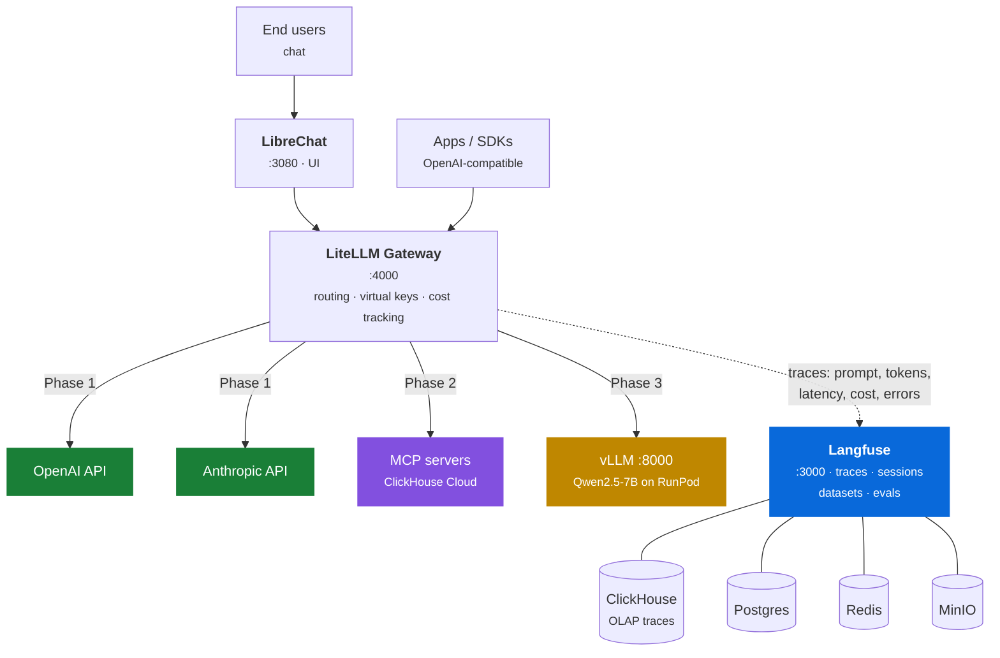

# LLMOPS In a Box

*Sovereign AI Stack*

> A composable, self-hosted enterprise AI stack — model serving, unified gateway, chat UI, and full-stack observability, built on open infrastructure.

LiteLLM · LibreChat · Langfuse · vLLM · OpenAI · Anthropic · RunPod · AWS · MinIO

[Get started](deployment.md){ .md-button .md-button--primary }
[See the phases](phases.md){ .md-button }

---

## Why this exists

Enterprises adopting GenAI face the same three questions:

<div class="grid cards" markdown>

-   :material-server-network: **Can we run our own models on our own infrastructure?**

    Data residency, network isolation, regulatory compliance.

-   :material-swap-horizontal: **Can we mix self-hosted models with commercial APIs?**

    OpenAI and Anthropic alongside our own models — without rewriting applications.

-   :material-chart-line: **Can we see everything in one place?**

    Every prompt, latency, token, cost, and failure.

</div>

This is a **reference architecture plus deployment scripts** that answers all three with open-source building blocks. Layers are fixed; implementations are swappable.

---

## Architecture



### A single request, end to end

1. A user sends a message in LibreChat (or any OpenAI-compatible client) and picks a model — `gpt-4o`, `claude-sonnet`, or from Phase 3, `qwen-7b`.
2. LiteLLM receives it on **one unified endpoint**, resolves the model alias, and routes it to the right provider. Anthropic's format translation is handled for you.
3. The response streams back.
4. LiteLLM's success/failure callbacks push the full trace — prompt, completion, latency, token counts, computed cost — into **Langfuse**, where ClickHouse stores and serves high-volume trace analytics.
5. In Langfuse you compare models side by side, build datasets from production traces, and score outputs.

!!! tip "Zero application code changes"
    Observability lives at the **gateway** layer, not in your app. Raw SDKs, LangChain, LlamaIndex, and future MCP-based agents are all traced identically — nothing to instrument.

---

## The layers

| Layer | Implementation | Phase |
|---|---|:--:|
| UI | LibreChat | 1 |
| Observability | Langfuse (ClickHouse · Postgres · Redis · MinIO) | 1 |
| Gateway | LiteLLM — routing, virtual keys, cost tracking | 1 |
| Models | OpenAI · Anthropic | 1 |
| Tools | MCP servers (ClickHouse Cloud first) | 2 |
| Serving | vLLM | 3 |
| Models | Self-hosted — Qwen, EXAONE, EEVE | 3 |
| Compute | RunPod · AWS | 3 |
| Storage | MinIO — datasets, artifacts, weights | 4 |
| Memory / Cache | MemKV — semantic caching | 4 |

---

## Quick start

```bash
brew install yq

cp secrets/credentials.example.yaml secrets/credentials.yaml
./scripts/stack.sh secrets gen       # values for self-generated keys
$EDITOR secrets/credentials.yaml     # paste those + your provider keys
./scripts/stack.sh secrets write     # generate .env (mode 600)

./scripts/stack.sh doctor            # preflight
./scripts/stack.sh up                # Phase 1 — no GPU needed
```

Continue with [Deployment](deployment.md), or read [Configuration](configuration.md) for how `stack.yaml` and `stack.sh` fit together.

---

## What this demonstrates

=== "Deployment & operations"

    - **Config-driven deployment** — one `stack.yaml` plus one script covers laptop and cloud; the target is a flag, not a fork in the config tree.
    - **Ease of deployment** — a vLLM template on RunPod is live in minutes versus EC2 GPU setup (AMI, drivers, networking). The rest is one `stack.sh up`.
    - **Fast cold-start** — RunPod pods spin up in seconds versus minutes-long cloud GPU provisioning.
    - **Cost efficiency** — per-second GPU billing with zero idle cost when stopped, typically 2–3× cheaper than on-demand cloud GPU pricing. LiteLLM cost tracking makes self-hosted versus API economics directly comparable in Langfuse.

=== "Architecture"

    - **Unified gateway** — one OpenAI-compatible endpoint in front of self-hosted and commercial models; applications never change when models do.
    - **Framework-neutral observability** — tracing lives at the gateway, so raw SDKs, LangChain, LlamaIndex, and MCP-based agents are captured identically.
    - **Composability** — every layer swaps out: vLLM → SGLang/TGI, RunPod → AWS/on-prem GPU, LibreChat → your own app.
    - **Incremental adoption, proven** — the [phase profiles](phases.md) are the argument: the same config carries you from APIs-only to fully self-hosted without a rewrite.

=== "Enterprise fit"

    - **Sovereignty & compliance** — the full path (UI → gateway → model → traces) can run inside your own network boundary. Relevant to regulated and air-gapped environments, including Korean 망분리 / ISMS-P contexts. `--profile airgapped` enforces no commercial API egress.
    - **Gradual adoption** — start with commercial APIs, add self-hosted models later behind the same gateway, with one observability pane throughout.
    - **Scale story** — Langfuse's ClickHouse backend handles production trace volume; the same architecture extends from a laptop demo to millions of traces per day.
