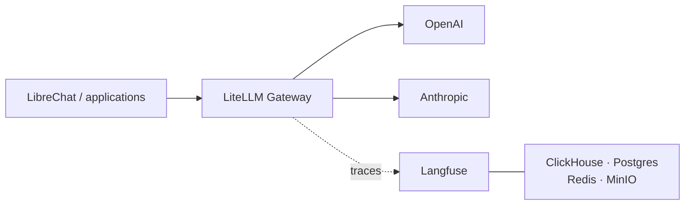

---
hide:
  - navigation
---

Composable LLMOps reference stack

# LLMOPS In a Box

One gateway for commercial and self-hosted models, one trace pipeline, and one
declarative stack definition.

LiteLLM · LibreChat · Langfuse · ClickHouse · OpenAI · Anthropic

[Get started](getting-started.md){ .md-button .md-button--primary }
[Run the workshop](workshop.md){ .md-button }
[See the phases](phases.md){ .md-button }

---

## What runs today

Phase 1 runs on Docker Compose:

- LiteLLM provides one OpenAI-compatible gateway.
- LibreChat provides the model picker and chat UI.
- OpenAI and Anthropic provide model inference.
- Langfuse records traces, tokens, latency, cost, and failures.
- ClickHouse, Postgres, Redis, MinIO, and MongoDB support the application
  services.

At least one external model-provider key is required. Phase 1 sends model
requests outside the local network and is not an air-gapped deployment.

AWS EC2, Kubernetes, MCP tools, self-hosted vLLM, artifact storage, and
operating recipes remain planned. The docs label them accordingly.

## Request path

Applications depend on a model alias and one endpoint. The provider wire
format, routing, retry policy, and trace callback stay behind LiteLLM.

## Why the gateway matters

Without a shared request path, model selection, cost data, tracing, and policy
are reimplemented by each application. A gateway creates one place to:

- switch providers without changing client protocols
- attribute spend by request, model, or key
- observe success and failure consistently
- apply routing and policy before external egress

The trade-off is another critical service in the request path. See
[Background](background.md) for the design rationale and alternatives.

## Start here

1. [Getting started](getting-started.md) — choose the runnable target and
   configure credentials.
2. [Phase 1 workshop](workshop.md) — start the stack and inspect a traced
   request.
3. [Configuration](configuration.md) — understand `stack.yaml`, profiles, and
   generated files.

Reference pages:

| Topic | Page |
|---|---|
| Credential inventory and security | [Credentials](credentials.md) |
| Current and planned scope | [Build-out phases](phases.md) |
| Lifecycle commands and targets | [Deployment](deployment.md) |
| Presentation script | [Demo flow](demo-flow.md) |
