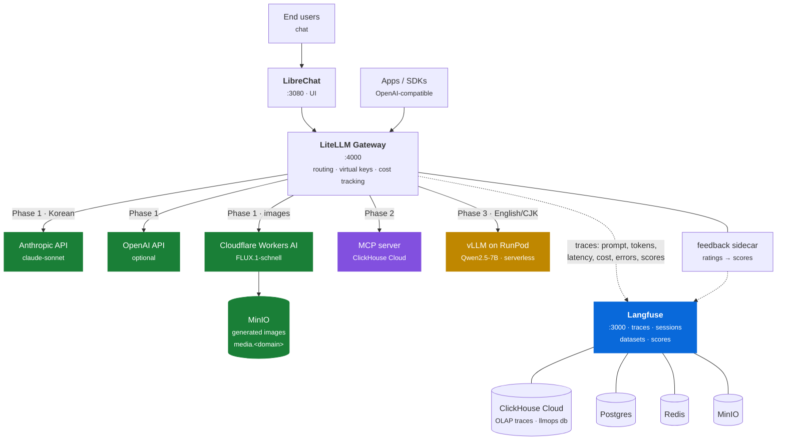
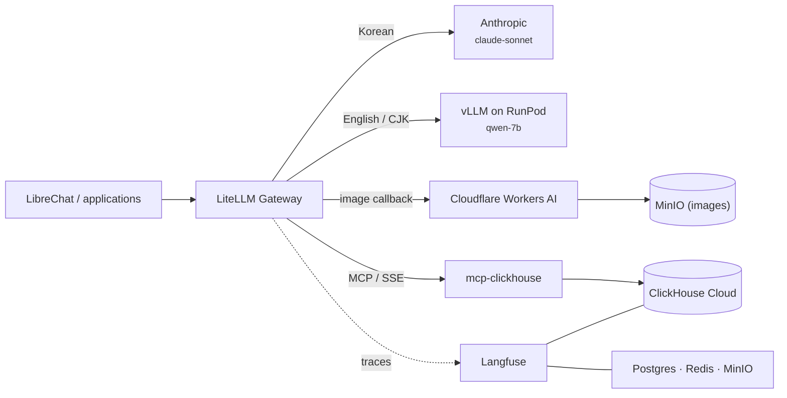

---
hide:
  - navigation
  - toc
---

Composable LLMOps reference stack

# LLMOps in a Box

One gateway for commercial and self-hosted models, one trace pipeline, and one
declarative stack definition.

LiteLLM · LibreChat · Langfuse · ClickHouse · Anthropic · RunPod · Cloudflare · MinIO

[Get started](getting-started.md){ .md-button .md-button--primary }
[Run the workshop](workshop.md){ .md-button }
[See the phases](phases.md){ .md-button }

---

## Why this exists

Enterprises adopting GenAI keep arriving at the same questions:

-   :material-server-network: **Can we run our own models on our own infrastructure?**

    Data residency, network isolation, regulatory compliance.

-   :material-swap-horizontal: **Can we mix self-hosted models with commercial APIs?**

    OpenAI and Anthropic alongside our own models — without rewriting applications.

-   :material-chart-line: **Can we see everything in one place?**

    Every prompt, latency, token, cost, and failure.

-   :material-gavel: **Can the system act on its own quality data?**

    Outputs scored by an LLM judge, and those scores changing how requests are
    routed.

-   :material-layers-triple: **Can we replace a layer without rewriting the stack?**

    vLLM → SGLang, RunPod → on-prem GPU, LibreChat → your own app. No layer
    should be a bet on a single vendor.

-   :material-radar: **Which parts of the sovereign-AI landscape are real?**

    The space turns over every few months and much of it is still claims.
    Standing a layer up is how you find out which ones hold.

This is a **reference architecture plus deployment scripts** that answers all
six with open-source building blocks. Layers are fixed; implementations are
swappable.

The last two are why the layer boundaries are worth the effort. A fixed layer
with a swappable implementation is both an escape route and an instrument: when
a new serving engine, GPU host, or cache appears, it can be tried in place of
the current one and measured against the same traces, instead of evaluated from
a vendor's benchmark. Keeping current with sovereign AI infrastructure is a
side effect of the architecture rather than a separate research project.

### The destination: an agent platform

Acting on quality data is the question that decides whether an agent platform can
be operated at all, which is why the others serve it.

A single completion can be judged by reading it. An agent cannot. It plans,
calls tools, and takes several steps, so its output space is too large to
inspect by hand and its failures are compositional — a correct answer reached
through the wrong tool call is still a defect, and nobody notices by eye.
Automated scoring is therefore not a reporting feature added at the end. It is
the only mechanism by which an agent's behaviour becomes known, and the only
signal a routing decision can act on.

That is what the layers add up to:

| Layer | What it contributes to the platform |
|---|---|
| Gateway | where models are reached and policy is enforced |
| Serving | models running on infrastructure you choose |
| Tools | what an agent is permitted to do |
| Observability | what it actually did |
| Evaluation | whether that was any good |
| Routing | what changes as a result |

They are built in that order because each one is what the next has to operate
on: nothing can score what was never traced, and nothing can route on a score
that does not exist. Closing the loop also needs one point that both
**measures** every request and **enforces** where it goes — the same point, or
there is no loop. That is the gateway, which is why it is the first thing built
rather than the last.

Tool use arrives in Phase 2; full agents and
the loop that makes them measurable are
[next steps](phases.md#judge-scored-routing) over the three phases that run
today. The scores already exist — nothing routes on them yet.

---

## The full picture

The architecture, with the phase that delivers each path. All three phases run
on the `aws-ec2` target today.

The two MinIO instances are deliberate. Langfuse runs one for its own blobs; the
image-hosting bucket is served via `media.<domain>` so generated images are
reachable over HTTPS without coupling to Langfuse's internal storage.

### The layers

| Layer | Implementation | Phase |
|---|---|:--:|
| UI | LibreChat | 1 |
| Observability | Langfuse (ClickHouse Cloud · Postgres · Redis · MinIO) | 1 |
| Gateway | LiteLLM — routing, virtual keys, cost tracking | 1 |
| Models (commercial) | Anthropic `claude-sonnet`, optionally OpenAI | 1 |
| Image generation | Cloudflare Workers AI (FLUX.1-schnell) → MinIO (`media.<domain>`) | 1 |
| Evaluation | Five automated scores per trace + feedback sidecar | 1 |
| Tools | MCP servers — ClickHouse Cloud, wired into the LiteLLM gateway | 2 |
| Serving (GPU) | vLLM on RunPod Serverless | 3 |
| Models (self-hosted) | Qwen2.5-7B-Instruct — EXAONE and EEVE as alternatives | 3 |
| Routing on scores | Judge scores feeding back into routing — no new layer | [next step](phases.md#next-steps) |

The layer list is the invariant. Which implementation fills a row is a
configuration decision in `stack.yaml`, which is why the phases can add rows
without rewriting the ones already there.

### A single request, end to end

1. A user sends a message in LibreChat (or any OpenAI-compatible client). The
   picker offers one model, `auto`, which activates language-aware routing at
   the gateway. `claude-sonnet` and `qwen-7b` can still be requested by name to
   bypass routing.
2. LiteLLM receives it on **one unified endpoint**, resolves the model alias,
   and routes it: Korean → `claude-sonnet` (Anthropic), English/CJK →
   `qwen-7b` (vLLM on RunPod). Anthropic's format translation is handled for you.
3. If the message contains image-generation intent (e.g. "draw", "그려줘"),
   a pre-call hook intercepts the request, fires off image generation to
   **Cloudflare Workers AI** (FLUX.1-schnell) in the background, and streams
   back the finished image as a markdown tag once it's uploaded to **MinIO**
   (`media.<domain>`). The chat UI renders it inline — no separate DALL-E UI
   needed.
4. If the message is Korean, the gateway also injects the **ClickHouse Cloud MCP
   tools** and runs the tool loop itself, so a client that knows nothing about
   MCP still receives a plain text answer built from query results.
5. For plain chat requests, the response streams back from the chosen provider.
6. LiteLLM's callback pushes the full trace — prompt, completion, latency,
   token counts, computed cost, routing decision, tool results — into
   **Langfuse**, where ClickHouse Cloud stores and serves trace analytics.
7. Five scores are attached automatically, and user ratings from LibreChat land
   on the same trace via the feedback sidecar.

!!! tip "Zero application code changes"
    Observability lives at the **gateway** layer, not in your app. Raw SDKs,
    LangChain, LlamaIndex, and MCP-based agents are all traced identically —
    nothing to instrument.

---

## What runs today

- LiteLLM provides one OpenAI-compatible gateway with language-aware routing.
- LibreChat provides the chat UI; the picker shows only `auto`.
- Anthropic serves Korean traffic; `qwen-7b` on RunPod Serverless serves
  English and CJK traffic, falling back to `claude-sonnet` when the endpoint is
  cold or stopped.
- ClickHouse Cloud is reached as an MCP server, injected at the gateway for
  Korean-language requests.
- Cloudflare Workers AI (FLUX.1-schnell) generates images on demand; results
  are uploaded to MinIO and served via `media.<domain>`.
- Langfuse records traces, sessions, tokens, latency, cost, failures, and five
  automated scores per completion.
- A feedback sidecar correlates LibreChat user ratings to Langfuse trace IDs via
  content hash.
- **ClickHouse Cloud** (`llmops` database) stores trace analytics. Postgres,
  Redis, and MinIO run locally for Langfuse's application data.

!!! warning "This is not an air-gapped deployment"
    Commercial provider keys are required, and the Phase 3 GPU worker runs on
    RunPod — outside the deployment's own network. Sovereignty is the argument
    the architecture makes: one gateway where the model choice, the policy, and
    the trace all live, so moving inference inside a boundary is a
    configuration change rather than a migration. Making that boundary a control
    would mean serving a model inside it, which nothing here provisions. See
    [Background](background.md#the-cross-border-question) for why the transfer
    question is the one that decides it.

---

## How the phases get there

| Phase | Outcome | Target | Status |
|:--:|---|---|---|
| 1 | Gateway, UI, tracing, and scoring over frontier APIs | Docker or EC2 | Running |
| 2 | MCP tool layer — ClickHouse Cloud | EC2 | Running |
| 3 | GPU serving on RunPod (`qwen-7b`) | EC2 + RunPod | Running |
| — | [Next steps](phases.md#next-steps): context routing, agents, evals, guardrails, judge-scored routing | EC2 | Not built |

The Status column reports implementation state, not scope. Phase 1 runs on
local Docker or EC2. Phase 2 and above require `--target aws-ec2`. The next
steps add no layer, which is why they carry no phase number. See
[Build-out phases](phases.md) for the end state and acceptance criteria.

---

## Why the gateway matters

Without a shared request path, model selection, cost data, tracing, and policy
are reimplemented by each application. A gateway creates one place to:

- switch providers without changing client protocols
- attribute spend by request, model, or key
- observe success and failure consistently
- apply routing and policy before external egress

The trade-off is another critical service in the request path. See
[Background](background.md) for the design rationale and alternatives.

## Start here

1. [Getting started](getting-started.md) — choose the runnable target and
   configure credentials.
2. [Phase 1 workshop](workshop.md) — start the stack and inspect a traced
   request.
3. [Configuration](configuration.md) — understand `stack.yaml`, profiles, and
   generated files.

Reference pages:

| Topic | Page |
|---|---|
| Credential inventory and security | [Credentials](credentials.md) |
| The end state and the build order | [Build-out phases](phases.md) |
| Lifecycle commands and targets | [Deployment](deployment.md) |
| Presentation script | [Demo flow](demo-flow.md) |
