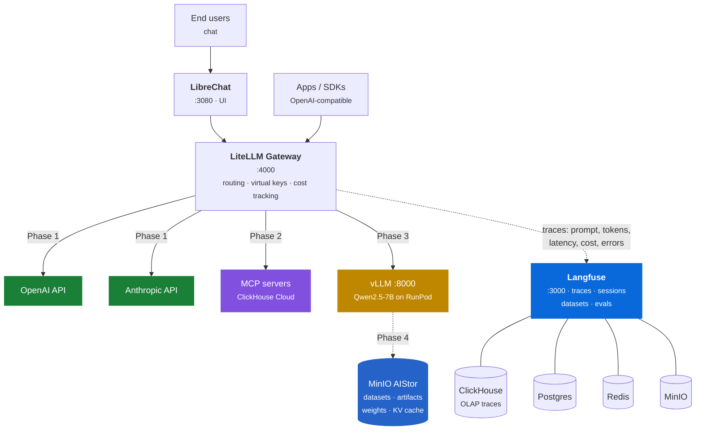
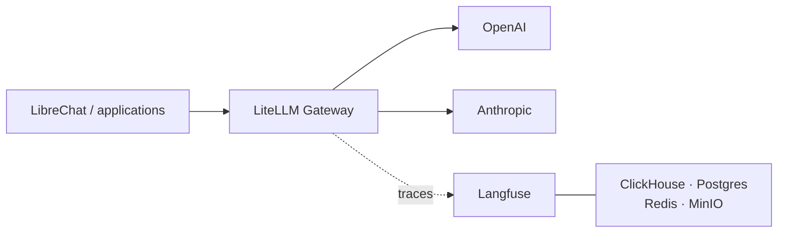

---
hide:
  - navigation
---

Composable LLMOps reference stack

# LLMOps in a Box

One gateway for commercial and self-hosted models, one trace pipeline, and one
declarative stack definition.

LiteLLM · LibreChat · Langfuse · ClickHouse · OpenAI · Anthropic

[Get started](getting-started.md){ .md-button .md-button--primary }
[Run the workshop](workshop.md){ .md-button }
[See the phases](phases.md){ .md-button }

---

## Why this exists

Enterprises adopting GenAI keep arriving at the same questions:

-   :material-server-network: **Can we run our own models on our own infrastructure?**

    Data residency, network isolation, regulatory compliance.

-   :material-swap-horizontal: **Can we mix self-hosted models with commercial APIs?**

    OpenAI and Anthropic alongside our own models — without rewriting applications.

-   :material-chart-line: **Can we see everything in one place?**

    Every prompt, latency, token, cost, and failure.

-   :material-gavel: **Can the system act on its own quality data?**

    Outputs scored by an LLM judge, and those scores changing how requests are
    routed.

-   :material-layers-triple: **Can we replace a layer without rewriting the stack?**

    vLLM → SGLang, RunPod → on-prem GPU, LibreChat → your own app. No layer
    should be a bet on a single vendor.

-   :material-radar: **Which parts of the sovereign-AI landscape are real?**

    The space turns over every few months and much of it is still claims.
    Standing a layer up is how you find out which ones hold.

This is a **reference architecture plus deployment scripts** that answers all
six with open-source building blocks. Layers are fixed; implementations are
swappable.

The last two are why the layer boundaries are worth the effort. A fixed layer
with a swappable implementation is both an escape route and an instrument: when
a new serving engine, GPU host, or cache appears, it can be tried in place of
the current one and measured against the same traces, instead of evaluated from
a vendor's benchmark. Keeping current with sovereign AI infrastructure is a
side effect of the architecture rather than a separate research project.

### The destination: an agent platform

Acting on quality data is the question that decides whether an agent platform can
be operated at all, which is why the others serve it.

A single completion can be judged by reading it. An agent cannot. It plans,
calls tools, and takes several steps, so its output space is too large to
inspect by hand and its failures are compositional — a correct answer reached
through the wrong tool call is still a defect, and nobody notices by eye.
Automated scoring is therefore not a reporting feature added at the end. It is
the only mechanism by which an agent's behaviour becomes known, and the only
signal a routing decision can act on.

That is what the layers add up to:

| Layer | What it contributes to the platform |
|---|---|
| Gateway | where models are reached and policy is enforced |
| Serving | models running inside the boundary, so the loop can run on private data |
| Tools | what an agent is permitted to do |
| Observability | what it actually did |
| Evaluation | whether that was any good |
| Routing | what changes as a result |

They are built in that order because each one is what the next has to operate
on: nothing can score what was never traced, and nothing can route on a score
that does not exist. Closing the loop also needs one point that both
**measures** every request and **enforces** where it goes — the same point, or
there is no loop. That is the gateway, which is why it is the first thing built
rather than the last.

Agents arrive in Phase 2 and
Phase 5; the loop that makes them measurable
is [Phase 5.5](phases.md#55-closing-the-loop-judge-scored-routing). What runs
today is the gateway and the trace pipeline underneath all of it.

---

## The full picture

This is the architecture the stack is being built toward, with the phase that
delivers each path. The phases are a build order, not a menu — every layer shown
here is in scope. Today only the Phase 1
paths run.

The two MinIO instances are deliberate. Langfuse runs one for its own blobs;
AIStor is a separate store you own, so your dataset and artifact lifecycle is
not coupled to another product's schema and retention.

### The layers

| Layer | Implementation | Phase |
|---|---|:--:|
| UI | LibreChat | 1 |
| Observability | Langfuse (ClickHouse · Postgres · Redis · MinIO) | 1 |
| Gateway | LiteLLM — routing, virtual keys, cost tracking | 1 |
| Models | OpenAI · Anthropic | 1 |
| Tools | MCP servers (ClickHouse Cloud first) | 2 |
| Serving | vLLM | 3 |
| Models | Self-hosted — Qwen, EXAONE, EEVE | 3 |
| Compute | RunPod · AWS | 3 |
| Storage | MinIO AIStor — datasets, artifacts, weights | 4 |
| KV cache | LMCache — prefill a long shared prefix once, reuse it | 4a |
| *(recipes)* | Context routing · LibreChat Agents · Langfuse evals — no new layer | 5 |

The layer list is the invariant. Which implementation fills a row is a
configuration decision in `stack.yaml`, which is why the phases can add rows
without rewriting the ones already there.

### A single request, end to end

1. A user sends a message in LibreChat (or any OpenAI-compatible client) and
   picks a model — `gpt-4o`, `claude-sonnet`, or from Phase 3, `qwen-7b`.
2. LiteLLM receives it on **one unified endpoint**, resolves the model alias,
   and routes it to the right provider. Anthropic's format translation is
   handled for you.
3. The response streams back.
4. LiteLLM's success and failure callbacks push the full trace — prompt,
   completion, latency, token counts, computed cost — into **Langfuse**, where
   ClickHouse stores and serves high-volume trace analytics.
5. In Langfuse you compare models side by side, build datasets from production
   traces, and score outputs.

!!! tip "Zero application code changes"
    Observability lives at the **gateway** layer, not in your app. Raw SDKs,
    LangChain, LlamaIndex, and future MCP-based agents are all traced
    identically — nothing to instrument.

---

## What runs today

Phase 1 is the subset of the diagram above that is running code:

- LiteLLM provides one OpenAI-compatible gateway.
- LibreChat provides the model picker and chat UI.
- OpenAI and Anthropic provide model inference.
- Langfuse records traces, tokens, latency, cost, and failures.
- ClickHouse, Postgres, Redis, MinIO, and MongoDB support the application
  services.

!!! warning "Phase 1 is not an air-gapped deployment"
    At least one external model-provider key is required, and every model
    request leaves the local network. Sovereignty is the argument the
    architecture makes; it becomes demonstrable in Phase 3, when there is a
    self-hosted model for `--profile airgapped` to fall back to. See
    [Background](background.md#the-cross-border-question) for why the transfer
    question is the one that decides it.

---

## How the phases get there

| Phase | Outcome | Status |
|:--:|---|---|
| 1 | Gateway, UI, and tracing over frontier APIs | In progress |
| 2 | MCP tool layer, starting with ClickHouse Cloud | Not built yet |
| 3 | vLLM self-hosted serving alongside provider APIs | Not built yet |
| 4 | Artifact storage and KV-cache reuse | Not built yet |
| 5 | Routing, agents, guardrails, and judge-scored routing | Not built yet |

The Status column reports implementation state, not scope. AWS EC2 and
Kubernetes targets are declared in `stack.yaml` but their deployment artifacts
are not implemented either. See [Build-out phases](phases.md) for the end state
and the acceptance criteria of each phase.

---

## Why the gateway matters

Without a shared request path, model selection, cost data, tracing, and policy
are reimplemented by each application. A gateway creates one place to:

- switch providers without changing client protocols
- attribute spend by request, model, or key
- observe success and failure consistently
- apply routing and policy before external egress

The trade-off is another critical service in the request path. See
[Background](background.md) for the design rationale and alternatives.

## Start here

1. [Getting started](getting-started.md) — choose the runnable target and
   configure credentials.
2. [Phase 1 workshop](workshop.md) — start the stack and inspect a traced
   request.
3. [Configuration](configuration.md) — understand `stack.yaml`, profiles, and
   generated files.

Reference pages:

| Topic | Page |
|---|---|
| Credential inventory and security | [Credentials](credentials.md) |
| The end state and the build order | [Build-out phases](phases.md) |
| Lifecycle commands and targets | [Deployment](deployment.md) |
| Presentation script | [Demo flow](demo-flow.md) |
