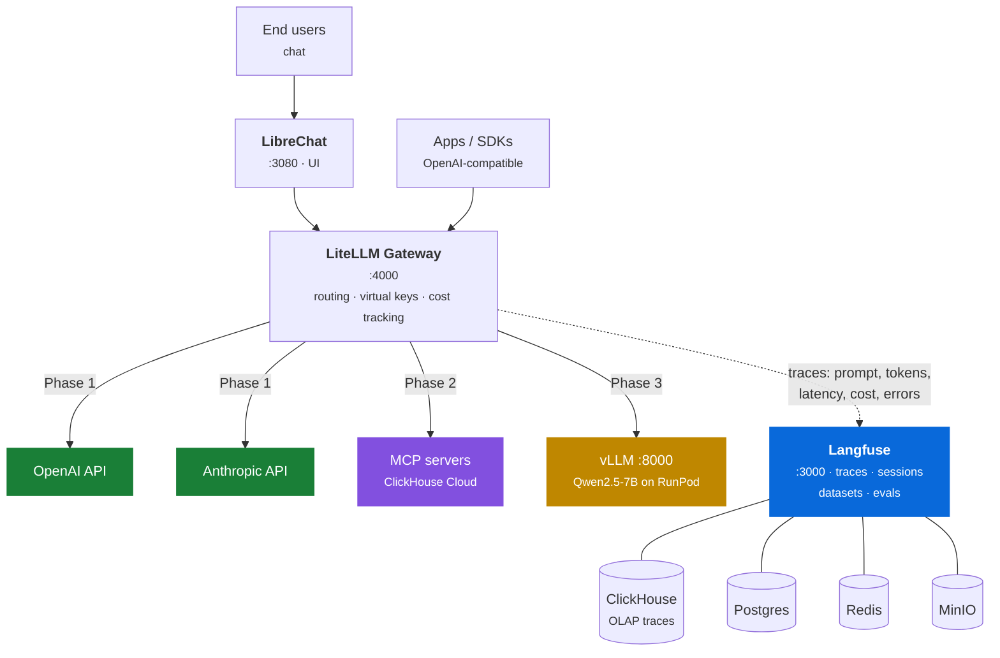

---
hide:
  - navigation
---

<div class="hero" markdown>

<span class="hero-eyebrow">Sovereign AI Stack</span>

# LLMOPS In a Box

<p class="hero-sub">
A composable, self-hosted enterprise AI stack — model serving, unified gateway,
chat UI, and full-stack observability, built entirely on open infrastructure.
Run your own models, mix in commercial APIs, and trace every request in one place.
</p>

<p class="hero-stack">
LiteLLM · LibreChat · Langfuse · vLLM · OpenAI · Anthropic · RunPod · AWS · MinIO
</p>

[Get started](deployment.md){ .md-button .md-button--primary }
[See the phases](phases.md){ .md-button }
[Background](background.md){ .md-button }

</div>

---

## Why this exists

Enterprises adopting GenAI face the same three questions:

<div class="grid cards" markdown>

-   :material-server-network: **Can we run our own models on our own infrastructure?**

    Data residency, network isolation, regulatory compliance.

-   :material-swap-horizontal: **Can we mix self-hosted models with commercial APIs?**

    OpenAI and Anthropic alongside our own models — without rewriting applications.

-   :material-chart-line: **Can we see everything in one place?**

    Every prompt, latency, token, cost, and failure.

</div>

This is a **reference architecture plus deployment scripts** that answers all three with open-source building blocks. Layers are fixed; implementations are swappable.

---

## Architecture



### A single request, end to end

1. A user sends a message in LibreChat (or any OpenAI-compatible client) and picks a model — `gpt-4o`, `claude-sonnet`, or from Phase 3, `qwen-7b`.
2. LiteLLM receives it on **one unified endpoint**, resolves the model alias, and routes it to the right provider. Anthropic's format translation is handled for you.
3. The response streams back.
4. LiteLLM's success/failure callbacks push the full trace — prompt, completion, latency, token counts, computed cost — into **Langfuse**, where ClickHouse stores and serves high-volume trace analytics.
5. In Langfuse you compare models side by side, build datasets from production traces, and score outputs.

!!! tip "Zero application code changes"
    Observability lives at the **gateway** layer, not in your app. Raw SDKs, LangChain, LlamaIndex, and future MCP-based agents are all traced identically — nothing to instrument.

---

## The layers

| Layer | Implementation | Phase |
|---|---|:--:|
| UI | LibreChat | 1 |
| Observability | Langfuse (ClickHouse · Postgres · Redis · MinIO) | 1 |
| Gateway | LiteLLM — routing, virtual keys, cost tracking | 1 |
| Models | OpenAI · Anthropic | 1 |
| Tools | MCP servers (ClickHouse Cloud first) | 2 |
| Serving | vLLM | 3 |
| Models | Self-hosted — Qwen, EXAONE, EEVE | 3 |
| Compute | RunPod · AWS | 3 |
| Storage | MinIO AIStor — datasets, artifacts, weights · object store free at one node | 4 |
| KV cache | LMCache — prefill a long shared prefix once, reuse it | 4a |
| *(recipes)* | Context routing · LibreChat Agents · Langfuse evals — no new layer | 5 |

---

## Quick start

```bash
brew install yq

./scripts/stack.sh secrets init
./scripts/stack.sh secrets setup     # optional d=default credentials; then g and w
./scripts/stack.sh secrets validate --phase 1

./scripts/stack.sh doctor            # preflight
./scripts/stack.sh up                # Phase 1 — no GPU needed
```

That brings up nine containers on six ports. For a guided run with checkpoints at each step, ending in a traced request you can see in Langfuse, follow the [Workshop](workshop.md).

Continue with [Deployment](deployment.md), or read [Configuration](configuration.md) for how `stack.yaml` and `stack.sh` fit together.

For the reasoning underneath all of it — why a gateway is the load-bearing decision, what was considered at each layer and rejected, why ClickHouse sits under Langfuse, what 망분리 and ISMS-P actually require, and a glossary of the terms these docs assume — see [Background](background.md).

---

## What this demonstrates

Every claim below is tagged with the phase that makes it **showable**, because most of them are not showable yet. Three of the four operational claims are about GPU economics, and [Phase 1](phases.md) has no GPU in it at all.

!!! warning "Read the badges before quoting any of this to a customer"
    A claim tagged <span class="phase phase-3">Phase 3</span> is an argument about the design, not something that can be put on screen today. Leading with GPU cost figures against a stack that is currently OpenAI and Anthropic only is exactly the kind of thing that gets taken apart in the room.

=== "Deployment & operations"

    - **Config-driven deployment** <span class="phase phase-1">Phase 1</span> — one `stack.yaml` plus one script covers laptop and cloud; the target is a flag, not a fork in the config tree.
    - **Cross-provider cost attribution** <span class="phase phase-1">Phase 1</span> — LiteLLM reports per-model cost into Langfuse, so OpenAI and Anthropic spend sits on one axis. This is the half of the cost story that works without a GPU.
    - **Ease of deployment** <span class="phase phase-3">Phase 3</span> — a vLLM template on RunPod is live in minutes versus EC2 GPU setup (AMI, drivers, networking). The rest is one `stack.sh up`.
    - **Fast cold-start** <span class="phase phase-3">Phase 3</span> — RunPod pods spin up in seconds versus minutes-long cloud GPU provisioning.
    - **GPU cost efficiency** <span class="phase phase-3">Phase 3</span> — per-second billing with zero idle cost when stopped, typically 2–3× cheaper than on-demand cloud GPU pricing. The *self-hosted versus API* comparison needs a self-hosted model to compare against, so it arrives with this phase, not before.
    - **Large context stops being priced per request** <span class="phase phase-4">Phase 4</span> — a long shared prefix (a system prompt, a policy document, a codebase) is prefilled once and reused instead of recomputed on every call. vLLM does this in GPU memory; LMCache offloads the cache to CPU, disk or the Phase 4 object store so it survives restarts and outgrows GPU memory. LMCache's published figure for a 128K-token prompt on an H100 is TTFT ~11s cold against ~1.5s on a cache hit.

=== "Architecture"

    - **Unified gateway** <span class="phase phase-1">Phase 1</span> — one OpenAI-compatible endpoint in front of self-hosted and commercial models; applications never change when models do.
    - **Framework-neutral observability** <span class="phase phase-1">Phase 1</span> — tracing lives at the gateway, so raw SDKs, LangChain and LlamaIndex are captured identically, with no application changes.
    - **Traced tool calls** <span class="phase phase-2">Phase 2</span> — the same applies to MCP-based agents: tool calls land in Langfuse beside the completion that triggered them.
    - **Composability** <span class="phase phase-3">Phase 3</span> — every layer swaps out: vLLM → SGLang/TGI, RunPod → AWS/on-prem GPU, LibreChat → your own app. Swapping the serving layer only becomes a demonstration once there is one.
    - **Incremental adoption** <span class="phase phase-3">Phase 3</span> — the [phase profiles](phases.md) are the argument, and the argument completes when the same config has actually carried the stack from APIs-only to self-hosted without a rewrite.
    - **An artifact store you own** <span class="phase phase-4">Phase 4</span> — datasets, eval artifacts and weights in a separate instance from the blob store Langfuse runs for itself, so your data lifecycle is not coupled to another product's schema and retention. The same instance backs the KV cache, so one store serves both.

=== "Enterprise fit"

    - **Scale story** <span class="phase phase-1">Phase 1</span> — Langfuse's ClickHouse backend handles production trace volume; the same architecture extends from a laptop demo to millions of traces per day.
    - **Gradual adoption** <span class="phase phase-1">Phase 1</span> — start with commercial APIs behind the gateway, with one observability pane from the first request.
    - **Sovereignty & compliance** <span class="phase phase-3">Phase 3</span> — the full path (UI → gateway → model → traces) inside your own network boundary, for regulated and air-gapped environments including Korean 망분리 / ISMS-P contexts. `--profile airgapped` enforces no commercial API egress — but it requires a self-hosted model to fall back to, so **Phase 1 egresses every request to OpenAI or Anthropic**. Worth stating plainly rather than letting the architecture diagram imply otherwise.
    - **Long internal documents never leave** <span class="phase phase-4">Phase 4</span> — the workloads that most want a 100k-token context are usually the ones you least want to send out: contracts, policy manuals, source code, incident history. Self-hosted serving plus KV-cache reuse makes processing them repeatedly affordable *inside* the boundary, which is the combination that turns "we cannot use long context" into a capacity question. See [Background](background.md#the-cross-border-question) for why the transfer question is the one that decides it.
