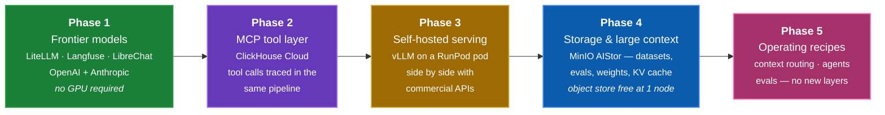

# Build-out phases

The stack is built **frontier-first**: get the gateway, tracing, and UI working against commercial APIs, then add tools, then self-hosting, then storage — and finally the operating recipes that only make sense once all of it is running.

Each phase is a **one-flag change**, not a config rewrite.

```bash
./scripts/stack.sh phases      # which phase is current, and what each adds
```

---

## Pre-Phase-1 confirmation

Phase 1 has not started. This is the verified state of the repository before it does — checked by running the things, not by reading them.

### Confirmed working

| Check | Evidence |
|---|---|
| `stack.yaml` parses, schema 1 | `doctor` reports it |
| `phases`, `config`, `models`, `render`, `secrets`, `urls` | all run; `config --profile phase-N` resolves for every phase |
| Layer dependencies resolve transitively | a profile naming a disabled layer warns and skips rather than failing |
| Every command named in these docs exists | cross-checked against the script's dispatch — no documented command is missing |
| Every flag named in these docs exists | `--target` `--profile` `--file` `--tf-var` `--all` `--no-render` `--purge` `--dry-run`, plus short forms `-t -p -f -n -h` |
| Internal doc links and anchors | zero broken across all pages |
| Ports in these docs match `stack.yaml` | all of them |
| `secrets audit` | passes — nothing sensitive tracked, in the index, or in history |

### Confirmed missing

| Gap | Consequence |
|---|---|
| **`docker/docker-compose.yml` does not exist** | `stack.sh up` exits 1. Never committed; there is no generator for it, so it is hand-written work |
| `secrets/credentials.yaml` is the blank template | `doctor` exits 1 on `LITELLM_MASTER_KEY`. Fixed by `secrets gen` |
| `terraform/` is not scaffolded | `--target aws-ec2` exits 1 with a clear message |

!!! info "`up` fails cleanly, and that was designed"
    ```console
    $ ./scripts/stack.sh up --dry-run
    error: compose file not found: docker/docker-compose.yml — not scaffolded yet (Phase 1)
    ```

    The check runs **before** the renderer, so a failed `up` leaves no half-written config behind — verified by a clean `git status docker/` afterwards.

    It also runs in the parent shell rather than inside `compose_args`, and the script says why: a `die` inside a command substitution would only exit the subshell, and `docker compose` would then run with no `-f` and pick up whatever compose file happened to be in the working directory. Worth knowing, because that failure would have been silent and wrong rather than loud and correct.

### What starting Phase 1 actually requires

1. Write `docker/docker-compose.yml` — seven services across the `gateway`, `obs` and `ui` compose profiles
2. `./scripts/stack.sh secrets gen` and fill in two provider keys
3. `./scripts/stack.sh doctor` green, then `up`, then `status`

Nothing else in the repository is in the way.

### Re-running this check

```bash
./scripts/stack.sh doctor --all         # tooling, secrets, layers, models
./scripts/stack.sh secrets audit        # leak and ignore-coverage check
./scripts/stack.sh config --profile phase-1
./scripts/stack.sh up --dry-run         # expected to fail until compose exists
mkdocs build --strict                   # docs, links and anchors
```

---

## Why this order

!!! quote "Phase 1 proves the architecture with zero infrastructure risk"
    The interesting claims of this stack — a unified gateway, gateway-level tracing, cost attribution across providers — are all testable without a single GPU. Prove them first.

Everything after Phase 1 plugs into an **already-working observability pipeline**. When vLLM arrives in Phase 3, traces are already flowing, cost attribution already works, and the model picker already renders from one catalog. So a new layer is validated against a known-good baseline instead of debugging two moving parts at once.

The inverse order — GPU first — front-loads the least portable, most failure-prone work (drivers, proxy timeouts, cold starts, weight downloads) before there is any tracing in place to diagnose it with.

---

## The phases



### Phase 1 — Frontier models

:material-progress-wrench: **In progress**

LiteLLM gateway, Langfuse observability, and LibreChat against OpenAI and Anthropic. No GPU, no self-hosting, no cold starts.

**Adds** `gateway` · `observability` · `ui` · `gpt-4o` · `claude-sonnet`

```bash
./scripts/stack.sh up --profile phase-1     # the default
```

#### What actually comes up

Three layers, seven containers. The gap is worth knowing before the first `docker compose up` — Langfuse v3 is not one service.

| Service | Port | Role |
|---|---|---|
| LiteLLM | 4000 | the gateway — one OpenAI-compatible endpoint |
| Langfuse | 3000 | traces, cost, the dashboard you demo from |
| LibreChat | 3080 | chat UI, model picker rendered from the catalog |
| ClickHouse | 8123 · 9000 | Langfuse's OLAP trace storage |
| Postgres | 5432 | Langfuse metadata, users, projects |
| Redis | 6379 | Langfuse queue and cache |
| MinIO | 9001 · 9002 | Langfuse event-upload blob store |

The last four are **internal dependencies of the observability layer**, not separate layers you chose. They come up on the `obs` compose profile. In particular this MinIO is Langfuse's own — it is not the Phase 4 artifact store, which is a different instance on different ports.

#### The two models

| Alias | Model | Context | $/1k in | $/1k out |
|---|---|--:|--:|--:|
| `gpt-4o` | `openai/gpt-4o` | 128k | 0.0025 | 0.010 |
| `claude-sonnet` | `anthropic/claude-sonnet-4-5` | 200k | 0.003 | 0.015 |

Both are declared once in `stack.yaml` and rendered into *both* `litellm_config.yaml` (routing and cost) and `librechat.yaml` (the picker). Two providers with different wire formats behind one endpoint is the point — LiteLLM translates, so the application sees only the OpenAI shape.

#### Gateway settings that matter

```yaml
num_retries: 2
request_timeout_s: 600
drop_params: true          # tolerate params a given provider rejects
budget: { max_budget_usd: 50, duration: 30d }
callbacks: { success: [langfuse], failure: [langfuse] }
```

`drop_params` is what keeps one client working across two providers when they disagree on a parameter. The **failure** callback matters as much as the success one: a demo where errors vanish from the trace view is a demo that cannot answer "what happens when it breaks".

#### The deliverable

Send the same prompt to both providers through one endpoint, then open one Langfuse project and see both traces with correct per-model cost. That single screen is the architectural claim: the application did not know which provider it was talking to, and the cost report did.

!!! warning "Phase 1 has no data boundary"
    Every request in this phase leaves for OpenAI or Anthropic. The gateway, the tracing and the cost attribution are all real, but sovereignty is not — that arrives in Phase 3 with a self-hosted model to route to. Do not demo this phase to a regulated-industry audience as if the network boundary already held.

---

### Phase 2 — MCP tool layer

:material-timer-sand: **Planned**

MCP servers exposed to the gateway so tool calls are traced through the same pipeline.

The first server is **ClickHouse Cloud** — this is settled, not a shortlist. Agents query the warehouse over MCP, and every tool call lands in Langfuse alongside the completion that triggered it. It is the right first server for two reasons: the warehouse is the thing enterprise users actually want an agent to reach, and it makes the tool call and the completion measurable in one trace instead of two systems.

```yaml
# stack.yaml — layers.tools.options.servers
- name: clickhouse
  transport: sse
  url_env: MCP_CLICKHOUSE_URL
  credentials_env: [CLICKHOUSE_CLOUD_HOST, CLICKHOUSE_CLOUD_USER, CLICKHOUSE_CLOUD_PASSWORD]
  scopes: [read_only]
```

**Adds** `tools`

```bash
./scripts/stack.sh up --profile phase-2
```

#### Why route tools through the gateway

Tool calls are usually instrumented wherever the agent framework happens to live. That produces two telemetry systems that have to be joined by hand — and the join is exactly the question you want answered.

| | Tools instrumented in the app | Tools through the gateway |
|---|---|---|
| Where telemetry lands | the agent framework's own tracing | the same Langfuse project as completions |
| Cost of a multi-step run | sum it yourself across systems | one trace, one total |
| Switching frameworks | re-instrument | nothing changes |
| A failed tool call | often invisible to the LLM trace | a failed span next to the completion that caused it |

#### The trace shape

One request produces one trace with nested spans: the planning completion, each MCP tool call with its arguments and result, and the final completion. Per-step latency and cost sit on the same timeline. A multi-step agent is where per-request cost stops being obvious, which is why this is the interesting thing to trace rather than a nice-to-have.

#### The deliverable

Ask a question that genuinely requires the warehouse — one an LLM cannot answer from training data, like a count over your own tables. The answer should be correct, and the trace should show the SQL the agent actually ran. That second half is what makes the demo credible to a data team.

!!! warning "Scope the tool credential, not just the agent"
    An agent holding a tool has that credential's full grants. Prompt-level instructions are not an access control. Create a dedicated **read-only** ClickHouse Cloud user for the MCP server — never reuse the admin account — and confirm the grants before letting a model drive it. `scopes: [read_only]` in `stack.yaml` documents the intent; the database is what enforces it. See [Credentials](credentials.md).

---

### Phase 3 — Self-hosted serving

:material-timer-sand: **Planned**

vLLM on a RunPod GPU pod behind the same gateway, so self-hosted and commercial models sit side by side in one Langfuse project — which is what makes the cost comparison meaningful.

**Adds** `serving` · `qwen-7b`

```bash
./scripts/stack.sh up --profile phase-3
```

#### The one layer that is not a container

Every other layer is a compose service. This one is not:

```yaml
managed_by: runpod          # NOT a compose service — lives on a GPU pod
compose_profile: null
enabled: true               # nothing to scaffold here; the pod is provisioned
                            # in the RunPod console
```

`enabled: true` with nothing in this repo to start is deliberate. `--profile phase-3` works the moment `VLLM_API_BASE` points at a live pod — the gateway does not care that the model is somewhere else, which is the whole argument for putting routing at the gateway.

| | |
|---|---|
| GPU | 1× A40 or L40S — sufficient for a 7B model |
| Model | `Qwen/Qwen2.5-7B-Instruct` |
| Context | 32,768 |
| Precision | bfloat16 |
| Port | 8000 |

Korean-workload alternatives are declared under `layers.serving.options.alternatives`: `LGAI-EXAONE/EXAONE-3.5-7.8B-Instruct` and `yanolja/EEVE-Korean-Instruct-10.8B-v1.0`.

#### Degrading instead of erroring

`stack.yaml` declares a `qwen-7b → gpt-4o` fallback, so a cold or stopped pod serves an API model rather than a 500. The renderer **prunes that fallback automatically** when the target model isn't in the active profile — so `--profile airgapped` cannot silently egress to a commercial API. The safety property is enforced by config generation, not by remembering to be careful.

Note the context asymmetry while you are here: `qwen-7b` has a 32k window and `gpt-4o` has 128k. Falling back is not always a like-for-like substitution, which is what makes context-based routing a [Phase 5](#phase-5-operating-recipes) topic rather than a footnote.

#### The deliverable

Same prompt, three models — `gpt-4o`, `claude-sonnet`, `qwen-7b` — one Langfuse project, one cost axis. The self-hosted model is declared at `cost_per_1k: 0`, deliberately, so API spend shows against a zero-marginal-cost baseline.

!!! warning "Zero marginal cost is not zero cost"
    `cost_per_1k: 0` makes per-token comparison legible, but the pod bills by the second whether or not anything is inflight, and Langfuse never sees that number. Comparing a $0 self-hosted trace against a $0.03 API trace without naming the GPU hourly rate and the utilisation behind it overstates the case — and it is the first thing a competent buyer will ask. Bring the pod cost to the meeting separately; the break-even is a volume question, not a per-token one.

---

### Phase 4 — Storage and large context

:material-timer-sand: **Planned**

A **MinIO AIStor** instance for the things the stack produces and consumes but Langfuse should not own: evaluation datasets, eval run artifacts, and self-hosted model weights — and, when vLLM runs locally, the backend for [4a](#phase-4a-kv-cache-reuse).

**Adds** `storage` · `kvcache`

```bash
./scripts/stack.sh up --profile phase-4
```

#### Why a second MinIO

Langfuse v3 already runs a MinIO for its own event and media uploads. This is a **different instance on different ports**, and deliberately so.

| | Langfuse's MinIO | Phase 4 AIStor |
|---|---|---|
| Owned by | the observability layer | you |
| Contents | trace events, media uploads | datasets, eval artifacts, weights |
| Schema | Langfuse's, undocumented, may change | yours |
| Ports | 9001 console · 9002 API | 9011 console · 9012 API |
| Buckets | Langfuse-managed | `datasets`, `artifacts`, `weights` |

Writing your datasets into Langfuse's bucket couples your data lifecycle to an internal implementation detail of another product — its retention, its schema, its upgrade path. A separate instance costs one more container and keeps that boundary clean.

#### Licensing — why one node is the right scope

MinIO's [AIStor tiers](https://www.min.io/blog/introducing-new-subscription-tiers-for-minio-aistor-free-enterprise-lite-and-enterprise) (effective 23 December 2025):

| Tier | Deployment | Capacity | Cost |
|---|---|---|---|
| **AIStor Free** | **single node** | **no artificial limit** | **free** |
| Enterprise Lite | multi-node | under 400 TiB | paid |
| Enterprise | multi-node | no stated limit | paid |

AIStor Free includes erasure coding and bitrot protection, with community Slack support. It is single-node, so no distributed high availability — which is exactly right here. This stack is a reference architecture and a demo, not a production data platform, and Phase 4's **object store** fits inside the free tier with no licence spend and no capacity ceiling to plan around.

The line to watch is *nodes*, not terabytes: the moment the deployment goes multi-node it becomes Enterprise Lite. Worth stating plainly to a customer, because "free" and "unlimited capacity" together tend to invite the follow-up question.

---

### Phase 4a — KV-cache reuse

:material-timer-sand: **Planned — buildable, no vendor conversation needed**

The second half of Phase 4, and the reason it is "large context" and not just "storage". A long shared prefix — a system prompt, a policy document, a codebase — is prefilled **once** and reused, instead of recomputed on every request. LMCache's published figure for a 128K-token prompt on an H100 is TTFT around 11s cold against roughly 1.5s on a cache hit.

```yaml
# stack.yaml — layers.kvcache
impl: lmcache
managed_by: follows-serving      # not a container: runs in-process with vLLM
requires: [serving]
options:
  prefix_caching: true           # vLLM built-in, useful on its own
  backend_by_serving:
    runpod: pod-local            # CPU RAM + NVMe on the GPU pod
    compose: s3                  # the `storage` layer above
```

**This layer is not a container**, which is why `managed_by` is `follows-serving`. LMCache runs inside the vLLM process, so its lifecycle is the serving layer's — and the same declaration stays correct whether vLLM is on a RunPod pod or in a local compose service.

#### The backend is a per-target choice, and that is what makes every phase portable

| Where vLLM runs | Cache backend | Why |
|---|---|---|
| RunPod pod (`--target docker` or `aws-ec2`) | **pod-local** — the pod's CPU RAM and NVMe | the cache never leaves the pod, so nothing has to be reachable |
| Local compose service, on an NVIDIA host | **s3** — the `storage` layer on 9012 | everything is on one machine, so the object store is local too |

!!! danger "Do not point a remote pod at a laptop's object store"
    It is the obvious-looking way to make the laptop target "support" Phase 4, and it is wrong for two independent reasons:

    - **It would be slower than no cache at all.** KV-cache offload only pays when fetching a block beats recomputing prefill. 2–16 MB blocks over a residential uplink do not, so you would ship a feature that makes the demo worse.
    - **The blocks are derived from prompts.** Routing them through a third-party tunnel contradicts the sovereignty argument this whole stack exists to make.

    Selecting a pod-local backend costs nothing and avoids both.

!!! warning "\"Free at one node\" is the object store only — it does not extend to MemKV"
    These tiers are published for **AIStor**, the object storage product. [MemKV](#phase-4b-kv-cache-offload-at-fleet-scale) is a separate product, and nothing in the tier announcement covers it — its own page offers no free tier, no trial and no download, only *"Talk to a Specialist"* and *"Get Pricing"*.

    So do not carry "MinIO is free at one node" across to the KV-cache work. Phase 4's storage is free; Phase 4b is a commercial conversation. Conflating the two is an easy way to promise a customer something that was never offered.

---

### Phase 4b — KV-cache offload at fleet scale

:material-handshake-outline: **Needs a partnership conversation with MinIO — not self-serve**

`stack.yaml` carries a `memory` layer with `impl: memkv`. Reading [MinIO's MemKV page](https://www.min.io/product/memkv) against what the config actually declares turns up a mismatch worth recording rather than quietly shipping.

**What MemKV is.** A "purpose-built context memory store for AI inference" — a petascale, flash-backed pool for the transformer **KV cache**. It moves attention key/value blocks from GPU memory to NVMe over RDMA, bypassing file system and object protocols entirely, in 2–16 MB blocks. The target metrics are TTFT and TPOT; MinIO claims 95%+ sustained GPU utilisation and 40–60% lower cost per token.

**What it needs.** It runs as a single binary on NVIDIA STX-based systems, accelerated by NVIDIA Vera CPUs, built for Spectrum-X 800 GbE networking and PCIe Gen6.

That is not something a `docker compose up` on a laptop, or a single RunPod pod, can host. It is a GPU-fleet-scale component, and no amount of config makes it a Phase 4 container.

**And it cannot be self-served.** The product page carries no general-availability statement, no download, no trial, no free or developer edition — the only two calls to action are *"Talk to a Specialist"* and *"Get Pricing"*. It gives no ship date, and neither does it cite one for the NVIDIA hardware it depends on.

**Which makes the next step a partnership discussion, not an install.** There is no path where someone on this project downloads MemKV and tries it over an afternoon. Getting to an evaluation means going to MinIO directly and asking: is there an early-access or design-partner programme, what hardware would we actually need in front of it, what does the licensing look like, and is there anything that can be demonstrated before NVIDIA STX systems are obtainable.

Worth being precise about the framing. This is **not** blocked on a purchase order — you cannot buy your way in this quarter — and it is **not** covered by the AIStor Free tier that makes [Phase 4](#phase-4-storage-and-large-context) free. It is a commercial relationship to open, and that is a different kind of task with a different owner.

**And it is not a semantic cache.** `stack.yaml` currently declares `semantic_cache: true` and `similarity_threshold: 0.95` under `impl: memkv`. Those settings describe a different mechanism:

| | Semantic cache | KV-cache offload (MemKV) |
|---|---|---|
| Keyed on | prompt embedding | shared token prefix |
| Stores | the finished response | attention K/V blocks |
| Hit means | skip inference entirely | skip prefill recomputation |
| Sits | in front of the gateway | under the inference engine |
| Correctness risk | can serve a near-miss answer as if exact | none — identical math |
| Fits this stack | yes, LiteLLM supports it natively | no, needs STX-class hardware |

!!! note "What is still not scheduled"
    A **semantic cache** — embed the prompt, return a stored response above a similarity threshold — is a different mechanism from both the `kvcache` layer and MemKV, and is not part of either. LiteLLM supports it natively with a Redis backend if it is ever wanted, but it trades correctness for latency in a way KV-cache reuse does not, so it should be decided on its own terms.

    `stack.yaml`'s `memory` layer still carries `semantic_cache: true` and `similarity_threshold: 0.95` under `impl: memkv`. That mismatch is annotated in place rather than rewritten, because resolving it means choosing which of the three mechanisms the layer was supposed to be.

---

### Phase 5 — Operating recipes

:material-timer-sand: **Planned**

Everything above builds infrastructure. Phase 5 adds **no new layers** — it is the set of things worth actually doing once the gateway, tools, serving, and tracing are all up, and each one produces evidence in Langfuse rather than just a config diff.

**Adds** nothing — recipes over Phases 1–4

```bash
./scripts/stack.sh up --profile phase-5     # identical to phase-4
```

#### 5.1 — Context-based routing in LiteLLM

Route on the shape of the request, not on a hard-coded model name. The natural first rule is **context length**: a 2k-token question does not need the model you provisioned for 100k-token documents, and a 60k-token document must not be sent to a 32k-window model at all.

LiteLLM expresses this as context-window fallbacks — when a request exceeds a model's window, the router moves it to one that fits instead of returning a 400.

```yaml
# rendered into docker/litellm_config.yaml from the stack.yaml catalog
router_settings:
  context_window_fallbacks:
    - qwen-7b: [gpt-4o]        # 32k self-hosted → 128k commercial
```

**Verify:** send one short and one over-length prompt to the same alias. Both succeed; Langfuse shows two different models served them, with the cost difference attributed correctly. That last part is the point — routing that you cannot see in the cost report is routing you cannot defend in a review.

This is also where the airgapped constraint gets interesting: `--profile airgapped` prunes that fallback, so an over-length request fails loudly rather than silently egressing to OpenAI.

#### 5.2 — LibreChat Agents over the MCP tool layer

Phase 2 makes tools *available*. This makes something *use* them without a line of application code.

Configure an agent in `librechat.yaml` with the Phase 2 ClickHouse MCP server attached, give it a question that genuinely requires the warehouse, and let it run the tool-use loop.

**Verify:** one Langfuse trace containing nested spans — the planning completion, each MCP tool call with its arguments and result, and the final answer — with total cost across all steps. A multi-step agent is where per-request cost stops being obvious, which is exactly why it is the interesting thing to trace.

!!! warning "The agent inherits the credential, not your intent"
    An agent holding the ClickHouse MCP tool has every grant that credential has. Use the dedicated **read-only** user from [Credentials](credentials.md), and confirm the scope before letting a model drive it.

#### 5.3 — Langfuse evaluations

The stack's central claim is that self-hosted and commercial models can be compared on one dashboard. Cost comes free with the gateway. **Quality does not** — that needs evals, otherwise the comparison is half an argument.

1. Build a dataset in Langfuse from real Phase 1–3 traces, not synthetic prompts
2. Define an LLM-as-judge evaluator with an explicit scoring rubric
3. Run it across `gpt-4o`, `claude-sonnet`, and `qwen-7b`
4. Read cost and score on the same axes

**Verify:** a table that answers the actual procurement question — *is the self-hosted model good enough for this workload, and what does the gap cost?* Eval artifacts land in the Phase 4 `artifacts` bucket, which is one of the reasons that bucket exists.

!!! note "Judge selection is part of the experiment"
    Using one of the models under test as its own judge biases the result. Pick a judge outside the comparison set and say which one it was — a reviewer will ask.

#### 5.4 — Guardrails at the gateway

Same argument as tracing, applied to safety: put the check where every request already passes, not in each application.

An app-level guardrail protects one application. The next client — a notebook, a cron job, someone's `curl`, a new team — goes straight past it. Since everything in this stack already goes through LiteLLM to be traced, that is also the one place a guardrail cannot be routed around.

```yaml
# litellm_config.yaml — pre-call runs before egress, post-call before the
# response is returned
guardrails:
  - guardrail_name: pii-redaction
    litellm_params: { guardrail: presidio, mode: pre_call }
  - guardrail_name: prompt-injection
    litellm_params: { guardrail: prompt_injection, mode: pre_call }
  - guardrail_name: output-moderation
    litellm_params: { guardrail: moderation, mode: post_call }
```

**`mode` is the whole thing.** A PII filter running `post_call` has already sent the PII to OpenAI. Redaction that happens after egress is theatre — and on this stack it is a real risk, because [Phase 1](#phase-1-frontier-models) sends every request to a commercial API.

#### What to guard, and why here

| Guard | Runs | Why it belongs at the gateway |
|---|---|---|
| PII / 주민등록번호 redaction | pre-call | the only point before data leaves the boundary |
| Prompt-injection detection | pre-call | matters most for [Phase 2](#phase-2-mcp-tool-layer) agents holding a warehouse credential |
| Output moderation | post-call | applies identically to self-hosted and commercial models |
| Budget cap | per-key | already in `stack.yaml` — `max_budget_usd: 50 / 30d` |
| Virtual keys | per-team | attribute and cap spend per consumer, not per app |

The last two are worth naming as guardrails rather than config. A runaway agent loop is a safety incident with an invoice attached, and a budget cap is the control that stops it.

#### The deliverable

Send a prompt containing a synthetic resident registration number. It should reach the provider redacted, and the Langfuse trace should show that the guardrail fired. **Both halves matter** — a guardrail you cannot show firing is one you cannot take to an audit.

!!! warning "A SaaS guardrail undoes the airgapped profile"
    Several guardrail providers are hosted APIs. Routing prompts through one to check them for sensitive data means sending that data to a third party — which contradicts the entire [Phase 3](#phase-3-self-hosted-serving) sovereignty argument and would not survive a 망분리 review. If the deployment claims a network boundary, the guardrail has to run inside it too. Presidio is self-hosted; check any alternative before adopting it.

!!! note "Guardrails cost latency and are wrong sometimes"
    Every pre-call check sits in the critical path before the first token, and Phase 5.1's routing work is measured in exactly that. Both false positives (a blocked legitimate request) and false negatives are inevitable, so record the rate rather than asserting the guardrail works — the Langfuse traces are already there to measure it with.

---

## Profiles

Profiles select which layers and models come up. The `phase-N` profiles are cumulative.

| Profile | Layers | Models |
|---|---|---|
| `phase-1` *(default)* | gateway, observability, ui | `gpt-4o`, `claude-sonnet` |
| `phase-2` | + tools | `gpt-4o`, `claude-sonnet` |
| `phase-3` | + serving | + `qwen-7b` |
| `phase-4` | + storage | all |
| `phase-5` | same as `phase-4` — recipes add no layers | all |
| `headless` | gateway, observability | all enabled |
| `airgapped` | gateway, observability, ui, serving | `qwen-7b` only — no egress |

```bash
./scripts/stack.sh up --profile headless     # SDK demos, no chat UI
./scripts/stack.sh up --profile airgapped    # no commercial API egress
```

Layer dependencies resolve **transitively** — asking for a layer brings up what it needs. A profile referencing a not-yet-built layer warns and skips it rather than failing:

```console
$ ./scripts/stack.sh config --profile phase-3
  ! layer 'tools' is requested by profile 'phase-3' but has enabled: false — skipping
```

---

## Tracking

Phases live in `stack.yaml` under `phases:`, with `phases.current` marking where the build-out is. `defaults.profile` tracks it, so `./scripts/stack.sh up` with no flags always brings up the current phase.

```yaml
phases:
  current: 1
  1:
    name: Frontier models
    status: in_progress
    adds_layers: [gateway, observability, ui]
    adds_models: [gpt-4o, claude-sonnet]
```

`doctor` uses the same annotations to decide how far to look when checking credentials — in Phase 1 it stays quiet about RunPod and MCP keys you don't have yet.
