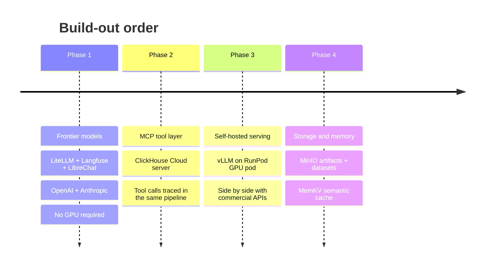

# Build-out phases

The stack is built **frontier-first**: get the gateway, tracing, and UI working against commercial APIs, then add tools, then self-hosting, then storage and memory.

Each phase is a **one-flag change**, not a config rewrite.

```bash
./scripts/stack.sh phases      # which phase is current, and what each adds
```

---

## Why this order

!!! quote "Phase 1 proves the architecture with zero infrastructure risk"
    The interesting claims of this stack — a unified gateway, gateway-level tracing, cost attribution across providers — are all testable without a single GPU. Prove them first.

Everything after Phase 1 plugs into an **already-working observability pipeline**. When vLLM arrives in Phase 3, traces are already flowing, cost attribution already works, and the model picker already renders from one catalog. So a new layer is validated against a known-good baseline instead of debugging two moving parts at once.

The inverse order — GPU first — front-loads the least portable, most failure-prone work (drivers, proxy timeouts, cold starts, weight downloads) before there is any tracing in place to diagnose it with.

---

## The phases



### Phase 1 — Frontier models

:material-progress-wrench: **In progress**

LiteLLM gateway, Langfuse observability, and LibreChat against OpenAI and Anthropic. No GPU, no self-hosting, no cold starts.

**Adds** `gateway` · `observability` · `ui` · `gpt-4o` · `claude-sonnet`

```bash
./scripts/stack.sh up --profile phase-1     # the default
```

The deliverable is a working trace pipeline: send a prompt to two different providers through one endpoint and see both traces, with correct per-model cost, in a single Langfuse project.

---

### Phase 2 — MCP tool layer

:material-timer-sand: **Planned**

MCP servers exposed to the gateway so tool calls are traced through the same pipeline. First target: **ClickHouse Cloud**, so agents can query the warehouse and every tool call lands in Langfuse alongside the completion that triggered it.

**Adds** `tools`

```bash
./scripts/stack.sh up --profile phase-2
```

!!! warning "Scope the tool credential, not just the agent"
    An agent holding a tool has that credential's full grants. Create a dedicated **read-only** ClickHouse Cloud user for the MCP server — never reuse the admin account. See [Credentials](credentials.md).

---

### Phase 3 — Self-hosted serving

:material-timer-sand: **Planned**

vLLM on a RunPod GPU pod behind the same gateway, so self-hosted and commercial models sit side by side in one Langfuse project — which is what makes the cost comparison meaningful.

**Adds** `serving` · `qwen-7b`

```bash
./scripts/stack.sh up --profile phase-3
```

`stack.yaml` declares a `qwen-7b → gpt-4o` fallback, so a cold or stopped pod degrades to an API model instead of erroring. The renderer **prunes that fallback automatically** when the target model isn't in the active profile — so `--profile airgapped` cannot silently egress to a commercial API.

Korean-workload alternatives (EXAONE-3.5, EEVE-Korean) are declared under `layers.serving.options.alternatives`.

---

### Phase 4 — Storage and memory

:material-timer-sand: **Planned**

MinIO for datasets, eval artifacts, and model weights — separate from the MinIO instance that backs Langfuse's event uploads. Plus MemKV for semantic caching and conversation memory.

**Adds** `storage` · `memory`

```bash
./scripts/stack.sh up --profile phase-4
```

---

## Profiles

Profiles select which layers and models come up. The `phase-N` profiles are cumulative.

| Profile | Layers | Models |
|---|---|---|
| `phase-1` *(default)* | gateway, observability, ui | `gpt-4o`, `claude-sonnet` |
| `phase-2` | + tools | `gpt-4o`, `claude-sonnet` |
| `phase-3` | + serving | + `qwen-7b` |
| `phase-4` | + storage, memory | all |
| `headless` | gateway, observability | all enabled |
| `airgapped` | gateway, observability, ui, serving | `qwen-7b` only — no egress |

```bash
./scripts/stack.sh up --profile headless     # SDK demos, no chat UI
./scripts/stack.sh up --profile airgapped    # no commercial API egress
```

Layer dependencies resolve **transitively** — asking for a layer brings up what it needs. A profile referencing a not-yet-built layer warns and skips it rather than failing:

```console
$ ./scripts/stack.sh config --profile phase-3
  ! layer 'tools' is requested by profile 'phase-3' but has enabled: false — skipping
```

---

## Tracking

Phases live in `stack.yaml` under `phases:`, with `phases.current` marking where the build-out is. `defaults.profile` tracks it, so `./scripts/stack.sh up` with no flags always brings up the current phase.

```yaml
phases:
  current: 1
  1:
    name: Frontier models
    status: in_progress
    adds_layers: [gateway, observability, ui]
    adds_models: [gpt-4o, claude-sonnet]
```

`doctor` uses the same annotations to decide how far to look when checking credentials — in Phase 1 it stays quiet about RunPod and MCP keys you don't have yet.
