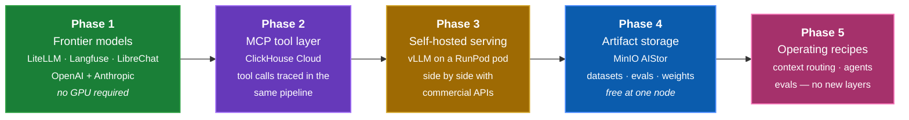

---
hide:
  - navigation
---

# Build-out phases

The stack is built **frontier-first**: get the gateway, tracing, and UI working against commercial APIs, then add tools, then self-hosting, then storage — and finally the operating recipes that only make sense once all of it is running.

Each phase is a **one-flag change**, not a config rewrite.

```bash
./scripts/stack.sh phases      # which phase is current, and what each adds
```

---

## Why this order

!!! quote "Phase 1 proves the architecture with zero infrastructure risk"
    The interesting claims of this stack — a unified gateway, gateway-level tracing, cost attribution across providers — are all testable without a single GPU. Prove them first.

Everything after Phase 1 plugs into an **already-working observability pipeline**. When vLLM arrives in Phase 3, traces are already flowing, cost attribution already works, and the model picker already renders from one catalog. So a new layer is validated against a known-good baseline instead of debugging two moving parts at once.

The inverse order — GPU first — front-loads the least portable, most failure-prone work (drivers, proxy timeouts, cold starts, weight downloads) before there is any tracing in place to diagnose it with.

---

## The phases



### Phase 1 — Frontier models

:material-progress-wrench: **In progress**

LiteLLM gateway, Langfuse observability, and LibreChat against OpenAI and Anthropic. No GPU, no self-hosting, no cold starts.

**Adds** `gateway` · `observability` · `ui` · `gpt-4o` · `claude-sonnet`

```bash
./scripts/stack.sh up --profile phase-1     # the default
```

The deliverable is a working trace pipeline: send a prompt to two different providers through one endpoint and see both traces, with correct per-model cost, in a single Langfuse project.

---

### Phase 2 — MCP tool layer

:material-timer-sand: **Planned**

MCP servers exposed to the gateway so tool calls are traced through the same pipeline.

The first server is **ClickHouse Cloud** — this is settled, not a shortlist. Agents query the warehouse over MCP, and every tool call lands in Langfuse alongside the completion that triggered it. It is the right first server for two reasons: the warehouse is the thing enterprise users actually want an agent to reach, and it makes the tool call and the completion measurable in one trace instead of two systems.

```yaml
# stack.yaml — layers.tools.options.servers
- name: clickhouse
  transport: sse
  url_env: MCP_CLICKHOUSE_URL
  credentials_env: [CLICKHOUSE_CLOUD_HOST, CLICKHOUSE_CLOUD_USER, CLICKHOUSE_CLOUD_PASSWORD]
  scopes: [read_only]
```

**Adds** `tools`

```bash
./scripts/stack.sh up --profile phase-2
```

!!! warning "Scope the tool credential, not just the agent"
    An agent holding a tool has that credential's full grants. Create a dedicated **read-only** ClickHouse Cloud user for the MCP server — never reuse the admin account. See [Credentials](credentials.md).

---

### Phase 3 — Self-hosted serving

:material-timer-sand: **Planned**

vLLM on a RunPod GPU pod behind the same gateway, so self-hosted and commercial models sit side by side in one Langfuse project — which is what makes the cost comparison meaningful.

**Adds** `serving` · `qwen-7b`

```bash
./scripts/stack.sh up --profile phase-3
```

`stack.yaml` declares a `qwen-7b → gpt-4o` fallback, so a cold or stopped pod degrades to an API model instead of erroring. The renderer **prunes that fallback automatically** when the target model isn't in the active profile — so `--profile airgapped` cannot silently egress to a commercial API.

Korean-workload alternatives (EXAONE-3.5, EEVE-Korean) are declared under `layers.serving.options.alternatives`.

---

### Phase 4 — Artifact storage

:material-timer-sand: **Planned**

A **MinIO AIStor** instance for the things the stack produces and consumes but Langfuse should not own: evaluation datasets, eval run artifacts, and self-hosted model weights.

**Adds** `storage`

```bash
./scripts/stack.sh up --profile phase-4
```

#### Why a second MinIO

Langfuse v3 already runs a MinIO for its own event and media uploads. This is a **different instance on different ports**, and deliberately so.

| | Langfuse's MinIO | Phase 4 AIStor |
|---|---|---|
| Owned by | the observability layer | you |
| Contents | trace events, media uploads | datasets, eval artifacts, weights |
| Schema | Langfuse's, undocumented, may change | yours |
| Ports | 9001 console · 9002 API | 9011 console · 9012 API |
| Buckets | Langfuse-managed | `datasets`, `artifacts`, `weights` |

Writing your datasets into Langfuse's bucket couples your data lifecycle to an internal implementation detail of another product — its retention, its schema, its upgrade path. A separate instance costs one more container and keeps that boundary clean.

#### Licensing — why one node is the right scope

MinIO's [AIStor tiers](https://www.min.io/blog/introducing-new-subscription-tiers-for-minio-aistor-free-enterprise-lite-and-enterprise) (effective 23 December 2025):

| Tier | Deployment | Capacity | Cost |
|---|---|---|---|
| **AIStor Free** | **single node** | **no artificial limit** | **free** |
| Enterprise Lite | multi-node | under 400 TiB | paid |
| Enterprise | multi-node | no stated limit | paid |

AIStor Free includes erasure coding and bitrot protection, with community Slack support. It is single-node, so no distributed high availability — which is exactly right here. This stack is a reference architecture and a demo, not a production data platform, and the whole of Phase 4 fits inside the free tier with **no licence spend and no capacity ceiling to plan around**.

The line to watch is *nodes*, not terabytes: the moment the deployment goes multi-node it becomes Enterprise Lite. Worth stating plainly to a customer, because "free" and "unlimited capacity" together tend to invite the follow-up question.

---

### Phase 4b — KV-cache offload

:material-alert-outline: **Blocked on hardware — not deployable in this stack**

`stack.yaml` carries a `memory` layer with `impl: memkv`. Reading [MinIO's MemKV page](https://www.min.io/product/memkv) against what the config actually declares turns up a mismatch worth recording rather than quietly shipping.

**What MemKV is.** A "purpose-built context memory store for AI inference" — a petascale, flash-backed pool for the transformer **KV cache**. It moves attention key/value blocks from GPU memory to NVMe over RDMA, bypassing file system and object protocols entirely, in 2–16 MB blocks. The target metrics are TTFT and TPOT; MinIO claims 95%+ sustained GPU utilisation and 40–60% lower cost per token.

**What it needs.** It runs as a single binary on NVIDIA STX-based systems, accelerated by NVIDIA Vera CPUs, built for Spectrum-X 800 GbE networking and PCIe Gen6.

That is not something a `docker compose up` on a laptop, or a single RunPod pod, can host. It is a GPU-fleet-scale component, and no amount of config makes it a Phase 4 container.

**And it is not a semantic cache.** `stack.yaml` currently declares `semantic_cache: true` and `similarity_threshold: 0.95` under `impl: memkv`. Those settings describe a different mechanism:

| | Semantic cache | KV-cache offload (MemKV) |
|---|---|---|
| Keyed on | prompt embedding | shared token prefix |
| Stores | the finished response | attention K/V blocks |
| Hit means | skip inference entirely | skip prefill recomputation |
| Sits | in front of the gateway | under the inference engine |
| Correctness risk | can serve a near-miss answer as if exact | none — identical math |
| Fits this stack | yes, LiteLLM supports it natively | no, needs STX-class hardware |

!!! warning "This needs a decision, not a config change"
    The two are worth having, but they are separate items at different scales. A semantic cache is a Phase 4-sized addition that LiteLLM can do today with a Redis backend. MemKV belongs on the roadmap as the scale-out path for when there is a real GPU fleet under Phase 3 — with its hardware prerequisites stated up front, so it never reads as one flag away.

    Nothing has been silently rewired. `stack.yaml` still declares the layer as it did; only the comments now say what the product actually is.

---

### Phase 5 — Operating recipes

:material-timer-sand: **Planned**

Everything above builds infrastructure. Phase 5 adds **no new layers** — it is the set of things worth actually doing once the gateway, tools, serving, and tracing are all up, and each one produces evidence in Langfuse rather than just a config diff.

**Adds** nothing — recipes over Phases 1–4

```bash
./scripts/stack.sh up --profile phase-5     # identical to phase-4
```

#### 5.1 — Context-based routing in LiteLLM

Route on the shape of the request, not on a hard-coded model name. The natural first rule is **context length**: a 2k-token question does not need the model you provisioned for 100k-token documents, and a 60k-token document must not be sent to a 32k-window model at all.

LiteLLM expresses this as context-window fallbacks — when a request exceeds a model's window, the router moves it to one that fits instead of returning a 400.

```yaml
# rendered into docker/litellm_config.yaml from the stack.yaml catalog
router_settings:
  context_window_fallbacks:
    - qwen-7b: [gpt-4o]        # 32k self-hosted → 128k commercial
```

**Verify:** send one short and one over-length prompt to the same alias. Both succeed; Langfuse shows two different models served them, with the cost difference attributed correctly. That last part is the point — routing that you cannot see in the cost report is routing you cannot defend in a review.

This is also where the airgapped constraint gets interesting: `--profile airgapped` prunes that fallback, so an over-length request fails loudly rather than silently egressing to OpenAI.

#### 5.2 — LibreChat Agents over the MCP tool layer

Phase 2 makes tools *available*. This makes something *use* them without a line of application code.

Configure an agent in `librechat.yaml` with the Phase 2 ClickHouse MCP server attached, give it a question that genuinely requires the warehouse, and let it run the tool-use loop.

**Verify:** one Langfuse trace containing nested spans — the planning completion, each MCP tool call with its arguments and result, and the final answer — with total cost across all steps. A multi-step agent is where per-request cost stops being obvious, which is exactly why it is the interesting thing to trace.

!!! warning "The agent inherits the credential, not your intent"
    An agent holding the ClickHouse MCP tool has every grant that credential has. Use the dedicated **read-only** user from [Credentials](credentials.md), and confirm the scope before letting a model drive it.

#### 5.3 — Langfuse evaluations

The stack's central claim is that self-hosted and commercial models can be compared on one dashboard. Cost comes free with the gateway. **Quality does not** — that needs evals, otherwise the comparison is half an argument.

1. Build a dataset in Langfuse from real Phase 1–3 traces, not synthetic prompts
2. Define an LLM-as-judge evaluator with an explicit scoring rubric
3. Run it across `gpt-4o`, `claude-sonnet`, and `qwen-7b`
4. Read cost and score on the same axes

**Verify:** a table that answers the actual procurement question — *is the self-hosted model good enough for this workload, and what does the gap cost?* Eval artifacts land in the Phase 4 `artifacts` bucket, which is one of the reasons that bucket exists.

!!! note "Judge selection is part of the experiment"
    Using one of the models under test as its own judge biases the result. Pick a judge outside the comparison set and say which one it was — a reviewer will ask.

---

## Profiles

Profiles select which layers and models come up. The `phase-N` profiles are cumulative.

| Profile | Layers | Models |
|---|---|---|
| `phase-1` *(default)* | gateway, observability, ui | `gpt-4o`, `claude-sonnet` |
| `phase-2` | + tools | `gpt-4o`, `claude-sonnet` |
| `phase-3` | + serving | + `qwen-7b` |
| `phase-4` | + storage | all |
| `phase-5` | same as `phase-4` — recipes add no layers | all |
| `headless` | gateway, observability | all enabled |
| `airgapped` | gateway, observability, ui, serving | `qwen-7b` only — no egress |

```bash
./scripts/stack.sh up --profile headless     # SDK demos, no chat UI
./scripts/stack.sh up --profile airgapped    # no commercial API egress
```

Layer dependencies resolve **transitively** — asking for a layer brings up what it needs. A profile referencing a not-yet-built layer warns and skips it rather than failing:

```console
$ ./scripts/stack.sh config --profile phase-3
  ! layer 'tools' is requested by profile 'phase-3' but has enabled: false — skipping
```

---

## Tracking

Phases live in `stack.yaml` under `phases:`, with `phases.current` marking where the build-out is. `defaults.profile` tracks it, so `./scripts/stack.sh up` with no flags always brings up the current phase.

```yaml
phases:
  current: 1
  1:
    name: Frontier models
    status: in_progress
    adds_layers: [gateway, observability, ui]
    adds_models: [gpt-4o, claude-sonnet]
```

`doctor` uses the same annotations to decide how far to look when checking credentials — in Phase 1 it stays quiet about RunPod and MCP keys you don't have yet.
